# z LLM Safety Gateway - Design Document

> **Version**: 0.3.0-draft
> **Date**: 2026-08-10
> **License**: Apache 2.0
> **Status**: Design Phase

---

## Table of Contents

1. [Project Overview](#1-project-overview)
2. [Market Opportunity](#2-market-opportunity)
3. [Overall Architecture](#3-overall-architecture)
4. [API Specification](#4-api-specification)
5. [Pipeline Engine](#5-pipeline-engine)
6. [Detector System](#6-detector-system)
7. [Third-party Detector Ecosystem](#7-third-party-detector-ecosystem)
8. [Streaming & Response Recall](#8-streaming--response-recall)
9. [LLM Provider Integration](#9-llm-provider-integration)
10. [Configuration System](#10-configuration-system)
11. [Security Design](#11-security-design)
12. [Audit, Logging & Observability](#12-audit-logging--observability)
13. [Deployment](#13-deployment)
14. [Performance Targets](#14-performance-targets)
15. [Technology Stack](#15-technology-stack)
16. [Project Structure](#16-project-structure)
17. [Testing Strategy](#17-testing-strategy)
18. [Development Roadmap](#18-development-roadmap)
19. [Open Source Governance](#19-open-source-governance)
20. [Appendix A: Decision Summary](#appendix-a-decision-summary)
21. [Appendix B: Open Questions & Future Decisions](#appendix-b-open-questions--future-decisions)

---

## 1. Project Overview

### 1.1 Project Name

- **Display Name**: z LLM Safety Gateway
- **Repository**: `z_llm_safety_gateway`
- **Python Package**: `z_llm_safety_gateway`
- **Detector SDK Package**: `z_llm_safety_gateway_sdk`

### 1.2 Vision

An open-source, modular LLM content safety gateway that protects enterprise LLM applications through input-side and output-side guardrails. The gateway acts as a transparent proxy between applications and LLM providers, performing real-time content safety detection and filtering with minimal latency overhead.

### 1.3 Target Users

- **Platform Teams**: Managing LLM infrastructure for multiple internal applications
- **Application Developers**: Building LLM-powered features who need safety compliance
- **Security/Compliance Teams**: Responsible for content safety policy enforcement and audit
- **Detector Developers**: Third-party vendors and open-source contributors building safety detectors (including commercial/closed-source detectors)

### 1.4 Core Value Proposition

| Value | Description |
|-------|-------------|
| **Zero-code Integration** | Applications point their LLM API base URL to the gateway - no code changes required |
| **Modular Detectors** | Pluggable detector architecture with rule-based, ML-based, LLM-as-Judge, and external API detectors |
| **Third-party Detector Ecosystem** | Mature plugin system supporting both in-process (Python) and gRPC sidecar detectors; open-source and commercial |
| **Parallel Pipeline** | All detectors run concurrently; short-circuit on block for minimal latency |
| **Streaming + Recall** | SSE streaming with sliding-window detection and post-audit response recall |
| **Enterprise Observability** | Structured JSONL audit logs, Prometheus metrics, OpenTelemetry tracing, stdout integration |
| **English-First, Chinese-Ready** | International design with native Chinese content detection support |

### 1.5 Internationalization Strategy

| Dimension | Approach |
|-----------|----------|
| Documentation | English primary, Chinese translation supplementary |
| Configuration files | English keys, English comments |
| Code comments | English |
| Detector content | Support both English and Chinese content detection (e.g., bilingual sensitive word lists) |
| Error messages | English |
| GitHub README | English |

---

## 2. Market Opportunity

### 2.1 Current Landscape Gap

ProtectAI LLM Guard, one of the most comprehensive open-source LLM safety toolkits with 35 detectors (15 input + 20 output scanners), was archived in July 2026. This left a significant gap in the open-source ecosystem.

### 2.2 Competitive Positioning

| Project | Type | Strengths | Weaknesses |
|---------|------|-----------|------------|
| NeMo Guardrails | Orchestration framework | 5 rail types, RAG support | Colang learning curve, complex config |
| Llama Guard 3 | Classification model | High accuracy, custom taxonomy | Requires GPU, no prompt injection coverage |
| Guardrails AI | Validation framework | Modular validators, Hub ecosystem | Output-focused, weak Agent support |
| Promptfoo | Testing tool | Strong red-teaming (acquired by OpenAI) | Not runtime protection |
| LLM Guard (archived) | Safety toolkit | 35 detectors, most comprehensive | **Archived, no longer maintained** |

### 2.3 Differentiation

1. **Fill the LLM Guard gap**: Rebuild and extend the detector ecosystem that was lost
2. **Parallel-first architecture**: All detectors run concurrently with short-circuit, optimized for latency
3. **Streaming-native**: SSE sliding-window detection + post-audit recall - not an afterthought
4. **Enterprise observability**: Structured audit logs, Prometheus metrics, OpenTelemetry tracing designed for integration with SLS, Azure Monitor, CloudWatch
5. **Bilingual detection**: English-first with native Chinese content detection support
6. **Open detector ecosystem**: Mature plugin system (in-process + gRPC sidecar) enabling third-party and commercial detectors with SDK, documentation, and examples

---

## 3. Overall Architecture

### 3.1 Gateway Pattern

The gateway operates as a transparent HTTP proxy. Applications send OpenAI-compatible API requests to the gateway; the gateway performs safety checks, then forwards approved requests to the upstream LLM provider.

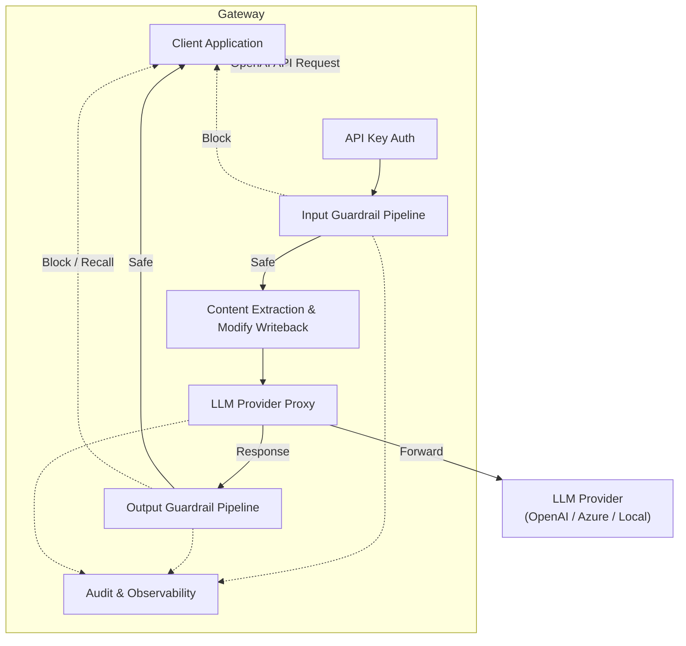

### 3.2 Request Processing Flow

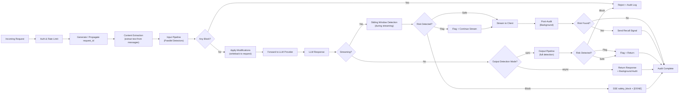

### 3.3 Core Components

| Component | Responsibility |
|-----------|---------------|
| **API Server** (FastAPI) | HTTP request handling, OpenAI-compatible endpoints |
| **Content Extractor** | Extract text from OpenAI request format (messages array, multimodal content) |
| **Pipeline Engine** | Parallel detector execution, short-circuit, result aggregation, priority ordering |
| **Detector Registry** | Detector discovery, registration, lifecycle management (in-process + gRPC) |
| **Plugin Loader** | Load in-process plugins (entry points) and gRPC sidecar detectors |
| **Provider Proxy** | Request forwarding, response streaming, provider routing |
| **Streaming Handler** | SSE proxy, sliding-window detection, recall signal emission |
| **Config Manager** | YAML loading, environment variable override, validation |
| **Audit Logger** | JSONL file writing, stdout structured output |
| **Metrics & Tracing** | Prometheus metrics endpoint, OpenTelemetry distributed tracing |
| **Security Layer** | API Key auth, rate limiting, TLS, request size limits, request_id propagation |

### 3.4 Content Extraction Logic

The gateway must extract text content from OpenAI API request formats for detection. The extraction strategy varies by endpoint and message role.

#### 3.4.1 Chat Completions (`/v1/chat/completions`)

The request contains a `messages` array with multiple messages. Extraction rules:

| Message Role | Input Detection | Rationale |
|-------------|-----------------|-----------|
| `system` | Checked | System prompts can contain injection attempts |
| `user` | Checked (primary focus) | Primary user input, highest risk |
| `assistant` | Not checked | Historical context, already generated by LLM |
| `function` / `tool` | Not checked | Function results, internal data |
| `developer` | Checked | New role in OpenAI API, treated like system |

**Extraction strategy**:
- Each `user` and `system` message is extracted individually
- Each message is passed to detectors as a separate detection unit
- Results are aggregated: if any message triggers `block`, the entire request is blocked
- For `modify` actions (e.g., PII redaction), the modification is applied to the specific message

**Multimodal content** (GPT-4V, etc.):
- v0.1: Only text parts (`type: "text"`) are extracted; image parts (`type: "image_url"`) are skipped
- v0.2+: Image content detection (future, requires multimodal models)

**Content part extraction**:
```python
def extract_content(messages: list[dict]) -> list[ExtractedContent]:
    """Extract detectable text content from OpenAI messages array."""
    results = []
    for idx, msg in enumerate(messages):
        if msg["role"] not in ("user", "system", "developer"):
            continue
        content = msg["content"]
        if isinstance(content, str):
            results.append(ExtractedContent(
                message_index=idx, role=msg["role"], text=content
            ))
        elif isinstance(content, list):
            # Multimodal: extract text parts only
            text_parts = [p["text"] for p in content if p.get("type") == "text"]
            if text_parts:
                results.append(ExtractedContent(
                    message_index=idx, role=msg["role"],
                    text="\n".join(text_parts)
                ))
    return results
```

#### 3.4.2 Modify Writeback

When a detector returns `action: "modify"` with `modified_content`, the modification is written back to the original request:

- The `modified_content` replaces the text of the specific message that was checked
- For multimodal messages, only the text parts are replaced; image parts are preserved
- Multiple `modify` actions are applied in **detector priority order** (see [Section 5.4](#54-detector-priority))
- The modified request is serialized back to OpenAI format and forwarded to the provider

```python
def apply_modifications(
    request: dict,
    modifications: list[Modification]
) -> dict:
    """Apply detector modifications back to the OpenAI request."""
    if not modifications:
        return request
    # Sort by priority (lower number = higher priority = applied first)
    modifications.sort(key=lambda m: m.priority)
    for mod in modifications:
        idx = mod.message_index
        if isinstance(request["messages"][idx]["content"], str):
            request["messages"][idx]["content"] = mod.modified_content
        elif isinstance(request["messages"][idx]["content"], list):
            # Multimodal: text parts were joined for detection.
            # Write modified_content to the FIRST text part, clear the rest.
            # Image parts are preserved.
            text_part_indices = [
                i for i, part in enumerate(request["messages"][idx]["content"])
                if part.get("type") == "text"
            ]
            if text_part_indices:
                request["messages"][idx]["content"][text_part_indices[0]]["text"] = mod.modified_content
                for i in text_part_indices[1:]:
                    request["messages"][idx]["content"][i]["text"] = ""
    return request
```

### 3.5 Non-streaming Output Detection

For non-streaming responses (`stream=false`), the output detection mode is configurable:

```yaml
pipeline:
  output_detection:
    mode: sync          # "sync" (default) | "async"
    sync_timeout: 5s    # max wait for output detection in sync mode
    recall:             # used only in async mode
      webhook_url: ""           # required when mode=async; POST endpoint for recall signals
      webhook_auth_header: ""   # optional auth header for webhook
```

| Mode | Behavior | Use Case |
|------|----------|----------|
| **sync** (default) | Wait for output detection to complete. If blocked, return error response instead of LLM response. | Safety-critical: prevents harmful content from reaching client |
| **async** | Return LLM response immediately. Run output detection in background. If risk found post-response, send recall via webhook. | Performance-critical: acceptable for low-risk scenarios; requires webhook config |

**`sync_timeout` behavior**: `sync_timeout` is a **pipeline-level** timeout for the entire output detection pipeline (all output detectors in parallel), not a per-detector timeout. If the pipeline exceeds `sync_timeout`:

1. The gateway stops waiting for remaining detector results
2. For detectors that already returned, their results are aggregated normally
3. For detectors that did not complete, the gateway applies each detector's `on_error` strategy (`fail_open` skips the result; `fail_closed` treats it as a block)
4. The aggregated result determines the final action

This is distinct from the per-detector `security.timeout.detector` (see [Section 11.5](#115-timeout-control)), which applies to individual detector execution. A detector that exceeds `security.timeout.detector` is marked as errored and its `on_error` strategy applies, regardless of `sync_timeout`.

In **async** mode, recall is only deliverable via webhook (no active SSE connection). The `output_detection.recall.webhook_url` must be configured; otherwise, post-response risks cannot be communicated to the client.

**Async audit logging**: In async mode, the gateway writes **two** audit entries for output detection:

1. **Initial entry** (written immediately when response is sent): `direction: "output"`, `final_action: "allow"` (response was sent), `async_detection: "pending"`. This entry records that the response was sent before detection completed.
2. **Completion entry** (written when background detection finishes): `direction: "output"`, `async_detection: "completed"`, with full detector results, `final_action`, `final_risk_level`, and `recalled` fields. This entry is linked to the initial entry via the same `request_id`.

Both entries share the same `request_id` but have different timestamps. The completion entry's `detectors` array contains the actual detection results. If the background detection finds a risk, `recalled: true` and `recall_method: "webhook"` are set in the completion entry.

```json
// Async completion audit entry (written after background detection)
{
  "request_id": "req_abc123",
  "timestamp": "2026-08-10T12:00:05.000Z",
  "direction": "output",
  "user_id": "user_001",
  "model": "gpt-4",
  "provider": "openai",
  "content_hash": "sha256:e5f6g7h8...",
  "content_length": 850,
  "language": "en",
  "detectors": [
    {
      "name": "toxicity",
      "action": "block",
      "confidence": 0.91,
      "risk_level": "high",
      "duration_ms": 35,
      "error": null
    }
  ],
  "final_action": "block",
  "final_risk_level": "high",
  "pipeline_duration_ms": 38,
  "total_duration_ms": 42,
  "streaming": false,
  "async_detection": "completed",
  "post_audit": null,
  "recalled": true,
  "recall_method": "webhook"
}
```

**Config relationship**: `output_detection` applies **only** to non-streaming responses (`stream=false`). For streaming responses (`stream=true`), output detection is handled by the `streaming` config (sliding window + post-audit). The two configs are mutually exclusive in practice: a given request is either streaming or non-streaming.

#### 3.5.1 Output Modification Writeback

When an output-side detector returns `action: "modify"` with `modified_content` (in non-streaming **sync** mode), the modification is applied to the LLM response before it is sent to the client. This is the output-side counterpart to input-side [Modify Writeback](#342-modify-writeback).

For chat completions, the LLM response contains a `choices[].message.content` field. Output modifications replace the content of the first choice:

```python
def apply_output_modifications(
    response: dict,
    modifications: list[Modification]
) -> dict:
    """Apply detector modifications to the LLM response (non-streaming sync mode)."""
    if not modifications:
        return response
    # Sort by priority (lower number = higher priority = applied first)
    modifications.sort(key=lambda m: m.priority)
    # Apply sequentially: each modification sees the result of the previous
    content = response["choices"][0]["message"]["content"]
    for mod in modifications:
        content = mod.modified_content
    response["choices"][0]["message"]["content"] = content
    return response
```

**Key differences from input-side modification**:
- Input modifications write back to `request["messages"][idx]` (per-message). Output modifications write to `response["choices"][0]["message"]["content"]` (single content field).
- Input modifications can target specific messages via `message_index`. Output modifications apply to the full response content (no message indexing).
- Output modifications are only applied in **sync** mode. In **async** mode, the response has already been sent; `modify` results are recorded in the audit log but not applied.
- In **streaming** mode, `modify` during sliding-window detection cannot be applied (tokens already sent). See [Section 8.2](#82-sliding-window-detection) for details.

**Multiple output modifications**: If multiple output detectors return `modify`, they are applied sequentially in priority order. Each modification operates on the result of the previous one (chained). This differs from input-side parallel modification, where all modifications are computed on the original content and may conflict. For output, the sequential chain ensures consistency.

---

## 4. API Specification

### 4.1 Supported Endpoints

#### MVP (v0.0.1 - v0.1.0)

| Endpoint | Method | Description | Detection |
|----------|--------|-------------|-----------|
| `/v1/chat/completions` | POST | Chat completions (streaming + non-streaming) | Input + Output |
| `/v1/models` | GET | List available models (passthrough) | None |
| `/health` | GET | Liveness probe | None |
| `/ready` | GET | Readiness probe | None |
| `/metrics` | GET | Prometheus metrics | None |

#### Future Endpoints

| Endpoint | Target Version | Notes |
|----------|---------------|-------|
| `/v1/completions` | v0.2.0 | Legacy completions API |
| `/v1/embeddings` | v0.2.0 | Input detection only |
| `/v1/images/generations` | v0.3.0 | Multimodal content detection |

### 4.2 Block Response Format

When a request is blocked by a detector, the gateway returns an **OpenAI-compatible error response** with a custom `safety` extension field. This ensures OpenAI SDK clients receive a parseable error, while applications that need detection details can access the `safety` field.

#### 4.2.1 Input Block

```json
HTTP 400 Bad Request

{
  "error": {
    "message": "Request blocked by safety policy: Prompt injection detected",
    "type": "safety_block",
    "param": null,
    "code": "safety_input_blocked",
    "safety": {
      "request_id": "req_abc123",
      "direction": "input",
      "blocked_by": "prompt_injection",
      "category": "prompt_injection",
      "risk_level": "critical",
      "confidence": 0.92,
      "action": "block",
      "message_index": 0,
      "details": {
        "matched_pattern": "ignore previous instructions",
        "detector_version": "0.1.0"
      }
    }
  }
}
```

#### 4.2.2 Output Block (Non-streaming)

```json
HTTP 422 Unprocessable Entity

{
  "error": {
    "message": "Response blocked by safety policy: Secret credential leak detected",
    "type": "safety_block",
    "param": null,
    "code": "safety_output_blocked",
    "safety": {
      "request_id": "req_abc123",
      "direction": "output",
      "blocked_by": "secret_leak",
      "category": "secret_leak",
      "risk_level": "critical",
      "confidence": 0.95,
      "action": "block",
      "details": {
        "matched_pattern": "AKIA[0-9A-Z]{16}",
        "detector_version": "0.1.0"
      }
    }
  }
}
```

#### 4.2.3 Output Block (Streaming, Mid-stream)

When a sliding-window block occurs during streaming, some tokens may have already been sent to the client. The gateway:

1. Immediately stops forwarding tokens
2. Sends a `safety_block` SSE event
3. Sends `data: [DONE]` to close the stream

```
event: safety_block
data: {"request_id":"req_abc123","blocked_by":"toxicity","category":"toxicity","risk_level":"high","confidence":0.91,"reason":"Toxic content detected in streaming window"}

data: [DONE]
```

**Already-streamed tokens cannot be recalled** via SSE. The post-audit recall mechanism (see [Section 8.3](#83-post-audit)) handles full-response risks after stream completion.

### 4.3 SSE Event Types

The gateway extends standard OpenAI SSE streaming with custom safety events:

| Event | Direction | Description |
|-------|-----------|-------------|
| `data: {chunk}` | Standard | Normal OpenAI token chunk (forwarded from provider) |
| `data: [DONE]` | Standard | Stream complete |
| `event: safety_block` | Custom | Mid-stream block - stops streaming, sends [DONE] |
| `event: safety_recall` | Custom | Post-audit recall signal (see [Section 8.4](#84-response-recall)) |
| `event: safety_flag` | Custom | Optional flag notification (enabled via config) |
| `event: error` | Standard | Provider streaming error (mid-stream); gateway sends error event + `[DONE]` (see [Section 9.7](#97-provider-error-handling)) |

**`safety_flag` event format**:

```
event: safety_flag
data: {"request_id":"req_abc123","flagged_by":"pii_redaction","category":"pii","risk_level":"medium","confidence":0.65,"message":"PII detected but below block threshold"}
```

When multiple detectors flag the same window, fields are aggregated: `flagged_by` and `category` become comma-separated lists, `risk_level` and `confidence` reflect the highest values among flagging detectors. See [Section 8.2](#82-sliding-window-detection) for details.

**Configuration**:

```yaml
pipeline:
  streaming:
    send_flag_events: false       # default: off; when true, sends safety_flag SSE events during streaming
```

Clients that only handle standard OpenAI SSE events will safely ignore custom events (per SSE spec, unknown events are skipped by `EventSource` clients). The `data: [DONE]` after `safety_block` ensures standard clients properly close the stream.

### 4.4 Error Codes

| Code | HTTP Status | Type | Description |
|------|-------------|------|-------------|
| `safety_input_blocked` | 400 | `safety_block` | Input blocked by detector |
| `safety_output_blocked` | 422 | `safety_block` | Output blocked by detector (non-streaming). HTTP 422 indicates the request was valid but the response content was unacceptable. |
| `safety_recall` | - (SSE event) | - | Post-audit recall signal (streaming) |
| `rate_limit_exceeded` | 429 | `rate_limit_error` | Rate limit exceeded |
| `authentication_error` | 401 | `authentication_error` | Invalid or missing API key |
| `provider_error` | 502 | `provider_error` | Upstream LLM provider error |
| `model_not_found` | 404 | `invalid_request_error` | No routing rule matches the model |
| `config_error` | 500 | `internal_error` | Gateway configuration error |
| `internal_error` | 500 | `internal_error` | Unexpected gateway error |

### 4.5 Response Headers

All responses include the following headers:

| Header | Description |
|--------|-------------|
| `X-Request-ID` | Gateway-generated or propagated request ID (UUID v4) |
| `X-Safety-Action` | Final safety action: `allow`, `block`, `flag`, `modify` |
| `X-Safety-Risk-Level` | Overall risk level: `low`, `medium`, `high`, `critical` (only when action != `allow`) |

> **Async output detection**: When `output_detection.mode: async`, the response is sent before output detection completes. The `X-Safety-Action` header reflects only the **input** detection result at response time (e.g., `allow` if input passed, `modify` if input was modified). Output detection results are delivered later via the recall webhook. The header does not indicate pending output detection — clients in async mode should rely on the webhook for output-side safety outcomes.

---

## 5. Pipeline Engine

### 5.1 Execution Model: Parallel + Short-Circuit

All enabled detectors for a given direction (input/output) execute **concurrently**. The engine monitors results as they complete:

- If **any** detector returns `block`, the engine **immediately short-circuits** - remaining detectors are cancelled, and the request is rejected.
- If **any** detector returns `modify`, the modification is collected and applied after all detectors complete. (Exception: if `short_circuit_on: block_and_modify` is configured, a `modify` result also triggers short-circuit, applying the modification immediately without waiting for remaining detectors.)
- If all detectors return `allow` or `flag`, the engine waits for all to complete, then aggregates results into a **complete risk profile**.

> **Note on `execution_mode`**: MVP supports **parallel mode only**. A `sequential` mode (detectors run one-by-one in priority order, useful for dependent detectors or cost optimization with external API detectors) is planned for v0.2.0+. The `execution_mode` config field is reserved but only `parallel` is valid in MVP.

**Short-circuit modes**:

| Mode | Behavior | Use Case |
|------|----------|----------|
| `block` (default) | Short-circuit only on `block` action. `modify` results wait for all detectors. | Default: ensures all modifications are collected before applying |
| `block_and_modify` | Short-circuit on both `block` and `modify` actions. The first `modify` is applied immediately. Remaining detectors are **cancelled** (not waited for). Their results are not collected. | Latency-sensitive: when a single modification (e.g., PII redaction) is sufficient and other detectors' results are not needed |

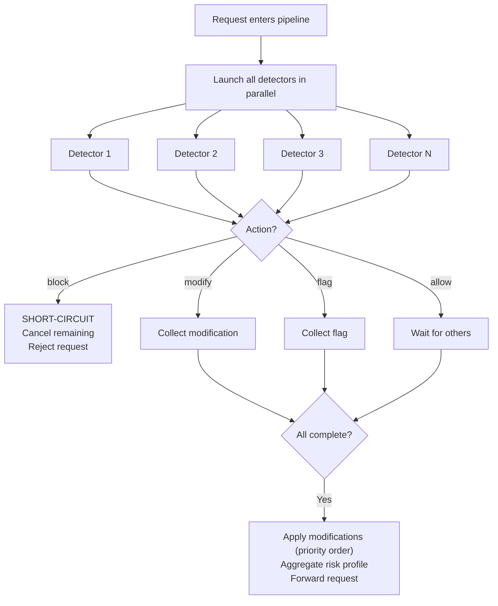

### 5.2 Detection Result Model

Each detector returns a structured result:

```python
class DetectionResult:
    """Result returned by a detector after examining content."""

    detector_name: str           # e.g., "prompt_injection"
    category: str                # risk category, e.g., "prompt_injection", "pii", "toxicity"
    action: str                  # "allow" | "block" | "flag" | "modify"
    confidence: float            # 0.0 - 1.0, detector's confidence in its judgment
    risk_level: str              # "low" | "medium" | "high" | "critical"
    message: str                 # human-readable explanation
    details: dict = {}           # detector-specific details
    modified_content: str | None = None  # if action="modify", the modified content
    duration_ms: float = 0.0     # execution time (populated by gateway, not detector)
    error: str | None = None     # error message if detector failed (populated by gateway)
```

> **Field population**: `DetectionResult` is defined in the SDK (`z_llm_safety_gateway_sdk.result`). Detectors create `DetectionResult` instances with the detection-specific fields (`detector_name`, `category`, `action`, `confidence`, `risk_level`, `message`, `details`, `modified_content`). The gateway populates `duration_ms` (measured around the `detect()` call) and `error` (set if the detector raised an exception or timed out) **after** the detector returns. Detectors should not set `duration_ms` or `error`.

### 5.2.1 Modification Model

When a detector returns `action: "modify"`, the pipeline engine constructs a `Modification` object that pairs the detector's `modified_content` with the context needed to apply it:

```python
class Modification:
    """Constructed by the pipeline engine when a detector returns action='modify'."""
    detector_name: str          # from DetectionResult.detector_name
    modified_content: str       # from DetectionResult.modified_content
    priority: int               # from the detector's config `priority` field
    message_index: int | None   # from DetectionContext.message_index
                                # input: index in messages array (for writeback)
                                # output: None (no messages array)
```

The pipeline engine creates `Modification` instances by combining:
- `DetectionResult` fields (`detector_name`, `modified_content`) — returned by the detector
- `DetectionContext.message_index` — the context passed to the detector
- Detector config `priority` — from the detector's YAML configuration

`Modification` is defined in the SDK (`z_llm_safety_gateway_sdk.modification`) and re-exported by the gateway. See [Section 3.4.2](#342-modify-writeback) for input-side writeback and [Section 3.5.1](#351-output-modification-writeback) for output-side writeback.

### 5.3 Threshold-Driven Action Decision

The detector internally computes a raw `confidence` score. The **action** is determined by thresholds configured per detector, not hardcoded in detector logic:

```yaml
detectors:
  input:
    - name: prompt_injection
      enabled: true
      config:
        block_threshold: 0.85    # confidence >= 0.85 -> block
        flag_threshold: 0.50     # 0.50 <= confidence < 0.85 -> flag
                                  # confidence < 0.50 -> allow
```

This separation allows enterprises to tune detector sensitivity without modifying detector code.

**Validation rule**: `block_threshold` must be greater than `flag_threshold`. Config validation will reject invalid thresholds.

#### 5.3.1 Threshold Namespace Separation (v0.4.0)

Two distinct threshold semantics MUST NOT share the same config keys:

- **Confidence thresholds** (`block_threshold` / `flag_threshold`): float in `[0.0, 1.0]`, consumed **only** by the `ThresholdDecisionEngine` to map a detector's `confidence` to an action. This is the single source of truth for action decision.
- **Count thresholds** (`count_block_threshold` / `count_flag_threshold`): integer, consumed **only** by count-based detectors (e.g. `sensitive_words`) to convert a raw match count into a `confidence` score (`min(match_count / count_block_threshold, 1.0)`).

Count-based detectors MUST **not** set `action` themselves; they emit structured evidence (e.g. `match_count`) and a normalized `confidence`, and let the engine decide the action via confidence thresholds. This removes dead action logic and prevents a count-int being misread as a confidence-float.

```yaml
detectors:
  input:
    - name: sensitive_words
      enabled: true
      config:
        count_block_threshold: 3    # >= 3 matches -> confidence 1.0
        count_flag_threshold: 1     # >= 1 matches -> confidence 0.5
        confidence_block_threshold: 0.8   # engine block threshold (optional override)
        confidence_flag_threshold: 0.5    # engine flag threshold (optional override)
```

A detector's config block may also override the engine-level confidence thresholds via optional `confidence_block_threshold` / `confidence_flag_threshold` keys; when absent, engine defaults apply. `_validate_thresholds` validates count thresholds and confidence thresholds independently.

### 5.4 Detector Priority

Detectors have a configurable `priority` field that determines:

1. **Modification order**: When multiple detectors return `modify`, modifications are applied in priority order (lower number = higher priority = applied first). For example, PII redaction (priority 10) before sensitive word replacement (priority 20).
2. **Log ordering**: Results in audit logs are ordered by priority.

```yaml
detectors:
  input:
    - name: pii_redaction
      enabled: true
      priority: 10               # applied first (modifications)
      config: ...

    - name: sensitive_words
      enabled: true
      priority: 20               # applied after PII redaction
      config: ...

    - name: prompt_injection
      enabled: true
      priority: 100              # default priority if not specified
      config: ...
```

- Default priority: `100`
- If two detectors have the same priority, the order in the YAML config is used as a tiebreaker
- Priority does **not** affect parallel execution order (all detectors launch simultaneously); it only affects modification application order and log ordering

### 5.5 Result Aggregation

When no detector blocks, the engine aggregates all results:

| Aggregation | Rule |
|-------------|------|
| **Final action** | If any `block` -> `block` (short-circuit). Else if any `modify` -> `modify`. Else if any `flag` -> `flag`. Else `allow`. |
| **Modifications** | All `modify` actions applied in priority order (e.g., PII redaction first, then sensitive word filter). In `block_and_modify` short-circuit mode, only the first `modify` result is collected (remaining detectors are cancelled); see [Section 5.1](#51-execution-model-parallel--short-circuit). |
| **Overall risk level** | Highest `risk_level` among all detector results |
| **Risk profile** | All `flag` results collected with full details |
| **Flags -> Block escalation** | Disabled by default. Optionally configurable (see below) |

**Action precedence**: `block` > `modify` > `flag` > `allow`. The final action is the highest-precedence action among all detector results. When the final action is `modify`, the request is forwarded with modifications applied. When the final action is `flag`, the request is forwarded as-is but the flag is recorded in the audit log and (optionally) the `X-Safety-Action` response header.

> **Parallel modify limitation**: In parallel mode, all detectors examine the **same original content** concurrently. When multiple detectors return `modify`, their modifications are applied sequentially in priority order, but each modification was computed independently on the original text — not on the result of the previous modification. This means:
> - Modification position offsets may become invalid after the first modification changes the text length (e.g., PII redaction shortens the text, shifting positions for the sensitive word filter).
> - Detectors that rely on character positions (regex match offsets) may produce incorrect modifications when applied after another modification.
>
> **Mitigation strategies**:
> 1. Design detectors to be position-independent (e.g., return fully modified content rather than patch instructions).
> 2. Use `short_circuit_on: block_and_modify` when only one modification is needed (e.g., PII redaction alone).
> 3. In the future `sequential` execution mode (v0.2.0+), each detector will see the modified content from the previous detector, resolving this issue.

### 5.6 Flag Escalation (Optional)

By default, multiple flags do not escalate to a block. Enterprises can enable escalation rules:

```yaml
pipeline:
  flag_escalation:
    enabled: false                # default: off
    rule: "count >= 3 and max_risk_level >= medium"
    action: block
```

**Rule syntax**: The `rule` field uses a simple expression DSL (not Python `eval`). Supported syntax:

| Element | Examples | Description |
|---------|----------|-------------|
| `count` | `count >= 3`, `count > 5` | Number of `flag` results from detectors |
| `max_risk_level` | `max_risk_level >= medium`, `max_risk_level == critical` | Highest risk level among flags. Levels ordered: `low` < `medium` < `high` < `critical` |
| `categories` | `categories contains pii` | Check if any flag's category matches |
| Operators | `>=`, `>`, `<=`, `<`, `==`, `!=` | Comparison operators |
| Logic | `and`, `or` | Combine conditions (left-to-right evaluation, no parentheses in MVP) |

**Validation**: Invalid rule syntax prevents startup with a descriptive error message. The rule is parsed at config load time, not at request time (no runtime parsing overhead).

### 5.7 Error Handling

Detector availability has two independent controls: `required` governs startup
admission, while `on_error` governs runtime and optional-startup failures.

| Configuration | Initialization failure | Runtime/health failure |
|---------------|------------------------|------------------------|
| `required: true`, `on_error: fail_closed` | Abort startup after reverse-order cleanup and durable lifecycle audit | Remove readiness and block traffic |
| `required: false`, `on_error: fail_closed` | Start diagnostic app as not-ready | `/ready` returns 503 and business requests are blocked before Provider routing |
| `required: false`, `on_error: fail_open` | Start ready but explicitly degraded | Skip the unavailable detector and continue with audit and metrics signals |

`required` defaults to `false`. `required: true` with `on_error: fail_open`, or
with `enabled: false`, is invalid configuration and prevents startup.

Configured per detector:

```yaml
detectors:
  input:
    - name: prompt_injection
      required: false
      on_error: fail_open
    - name: pii_redaction
      required: true
      on_error: fail_closed
```

### 5.8 Circuit Breaker (External Detectors)

For detectors that call external services (LLM-as-Judge, External API, gRPC sidecar), a circuit breaker prevents cascading failures:

```yaml
detectors:
  input:
    - name: llm_judge_hallucination
      enabled: true
      type: llm_as_judge
      circuit_breaker:
        enabled: true
        failure_threshold: 5       # consecutive failures before opening circuit
        recovery_timeout: 30s      # time before attempting to close circuit
        fallback_action: fail_open # action when circuit is open
```

| State | Behavior |
|-------|----------|
| **Closed** (normal) | Detector executes normally |
| **Open** (tripped) | Detector skipped; `fallback_action` applied immediately; no network call |
| **Half-Open** (testing) | After `recovery_timeout`, one trial request is sent. If success -> Closed. If failure -> Open. |

Circuit breaker state transitions are logged and exposed via metrics.

**Relationship between `on_error` and `circuit_breaker.fallback_action`**:

| Scenario | Mechanism | Config Field |
|----------|-----------|-------------|
| Detector execution fails (exception, timeout) while circuit is **closed** | `on_error` strategy applied (fail_open/fail_closed) | `on_error` |
| Circuit is **open** (too many consecutive failures) | `fallback_action` applied immediately, detector not called | `circuit_breaker.fallback_action` |
| Circuit is **half-open** and trial request fails | Circuit reverts to **open**, `fallback_action` applied | `circuit_breaker.fallback_action` |

Both fields default to `fail_open` if not specified. When a detector has no `circuit_breaker` configured, only `on_error` applies.

**Accepted values for `on_error` and `circuit_breaker.fallback_action`**:

| Value | Behavior |
|-------|----------|
| `fail_open` | Skip the detector, log error, continue processing (availability > safety) |
| `fail_closed` | Block the request, log error (safety > availability) |

Both `on_error` and `circuit_breaker.fallback_action` accept the same set of values (`fail_open` | `fail_closed`).

### 5.9 Caching

| Cache | Scope | Purpose | TTL |
|-------|-------|---------|-----|
| **Sensitive word list compilation** | Startup | Compile word lists to Aho-Corasick automaton for O(n) matching | None (in-memory, compiled once) |
| **Detector result cache** | Per-request | Not cached - each request is unique context | N/A |
| **ML model cache** | Process lifetime | Loaded models kept in memory for reuse | None (until process restart) |
| **Provider response** | N/A | **Not cached** - safety gateway must not serve cached LLM responses | N/A |

Sensitive word lists are compiled into an [Aho-Corasick automaton](https://en.wikipedia.org/wiki/Aho%E2%80%93Corasick_algorithm) at startup, enabling efficient multi-pattern matching in O(n) time where n is the input length, regardless of the number of patterns.

---

## 6. Detector System

### 6.1 Detector Interface

```python
from abc import ABC, abstractmethod
from typing import Optional

class Detector(ABC):
    """Base class for all detectors. Subclass and implement detect()."""

    name: str                    # unique detector identifier
    category: str                # risk category
    description: str             # human-readable description
    version: str                 # detector version

    @abstractmethod
    async def initialize(self, config: dict) -> None:
        """Initialize the detector with configuration. Called once at startup."""
        ...

    @abstractmethod
    async def detect(
        self,
        content: str,            # text to examine
        context: DetectionContext
    ) -> DetectionResult:
        """Execute detection and return result."""
        ...

    async def health_check(self) -> bool:
        """Check if the detector is healthy. Default: True."""
        return True

    async def shutdown(self) -> None:
        """Cleanup resources. Called on gateway shutdown."""
        ...


class DetectionContext:
    """Context passed to each detector."""

    direction: str               # "input" | "output"
    request_id: str              # request trace ID
    user_id: Optional[str]       # user identifier (if available). Extracted from the
                                 # OpenAI request's optional "user" field (string).
                                 # If absent, None. Used for per-user audit correlation.
    metadata: dict               # additional metadata
    language: Optional[str]      # detected language (e.g., "en", "zh")
    message_index: Optional[int] # input: index in messages array (for modify writeback).
                                 # output (non-streaming): None (no messages array).
                                 # output (streaming): None (windows are not message-indexed).
```

### 6.2 Detector Registration

Three registration mechanisms:

1. **Built-in detectors**: Ship with the package, enabled via YAML config
2. **In-process plugins**: Registered via Python entry points, auto-discovered on package install
3. **gRPC sidecar detectors**: Registered via YAML config with gRPC endpoint, runs as independent service

**`type` field**: The `type` field in detector config is optional for built-in and in-process detectors (identified by `name`). It is **required** for gRPC sidecar detectors (`type: grpc`). For built-in detectors with special behavior (e.g., LLM-as-Judge), `type` may be used to enable gateway features like circuit breaker defaults, but is not required for basic operation.

```python
# In-process plugin registration (in pyproject.toml of a third-party plugin package):
[project.entry-points."z_llm_safety_gateway.detectors"]
my_detector = "my_package.detectors:MyDetector"
```

```yaml
# gRPC sidecar detector registration (in gateway.yaml):
detectors:
  input:
    - name: commercial_injection_guard
      enabled: true
      type: grpc                    # denotes gRPC sidecar detector
      config:
        endpoint: "localhost:50051"
        tls_enabled: false
        api_key: ${COMMERCIAL_DETECTOR_API_KEY}    # passed to detector via Initialize()
        license_key: ${COMMERCIAL_DETECTOR_LICENSE} # passed to detector via Initialize()
      on_error: fail_open
      circuit_breaker:
        enabled: true
        failure_threshold: 5
        recovery_timeout: 30s
```

### 6.3 Detector Types

| Type | Latency | Deployment | GPU Required | Examples |
|------|---------|-----------|-------------|----------|
| **Rule-based** | < 1ms | In-process | No | Regex patterns, keyword lists, PII patterns |
| **ML-based** | 10-50ms | In-process | No (CPU inference) | Toxicity, sentiment classification |
| **LLM-as-Judge** | 200-500ms | In-process or gRPC | Optional | Hallucination check, semantic analysis |
| **External API** | varies | gRPC sidecar | No | Azure Content Safety, OpenAI Moderation |
| **gRPC Plugin** | varies | gRPC sidecar | Optional | Third-party, commercial detectors |

### 6.4 MVP Detector List

Five detectors for the initial release:

| # | Detector | Direction | Implementation | Rationale |
|---|---------|-----------|----------------|-----------|
| 1 | **Prompt Injection Detection** | Input | Rules + small ML model | Core security threat for LLM applications |
| 2 | **PII Detection & Redaction** | Input | Regex + Microsoft Presidio | Compliance requirement (GDPR, data protection) |
| 3 | **Toxicity Detection** | Input + Output | Small ML model | Basic content safety, works for both directions |
| 4 | **Sensitive Word / Topic Filter** | Input | Rule-based (configurable word lists) | Enterprise-customizable content control |
| 5 | **Secret / Credential Leak Detection** | Output | Regex patterns (API keys, tokens, private keys) | Prevent accidental leakage of sensitive credentials |

> **Model sharing for dual-direction detectors**: The toxicity detector is configured for both input and output. In MVP, each direction instantiates a separate detector with its own model instance. A model registry to share a single loaded model across directions (reducing memory by ~50%) is planned for v0.2.0+. Until then, both configs must specify `model_name`, `model_cache_dir`, and `offline_mode` independently.

### 6.5 ML Model Distribution

ML-based detectors (e.g., toxicity) require model files. Distribution strategy:

| Aspect | Approach |
|--------|----------|
| **Download** | Models downloaded from HuggingFace Hub on first use |
| **Cache directory** | `~/.cache/z_llm_safety_gateway/models/` (configurable via `model_cache_dir`) |
| **Version pinning** | Model version pinned in detector config: `model_name: "unitary/toxic-bert", model_version: "v1.0"`. Maps to HuggingFace Hub `revision` parameter (branch, tag, or commit hash). If omitted, the latest revision is used. |
| **Offline mode** | Pre-download models and bundle in Docker image. Set `offline_mode: true` to skip download |
| **Model size** | Typically 100-500MB per model (documented per detector) |
| **Lazy loading** | Models loaded on first detection call, not at startup (reduces startup time) |

**Config relationship**: The global `model_cache.dir` and `model_cache.offline_mode` (in the root config) provide defaults for all ML-based detectors. Individual detectors can override these via `model_cache_dir` and `offline_mode` in their own `config` section. Detector-level config takes precedence over global config.

> **Naming note**: The global config uses a nested namespace (`model_cache.dir`, `model_cache.offline_mode`), while detector-level config uses flat keys with a `model_cache_` prefix (`model_cache_dir`, `offline_mode`) inside the detector's `config` section. This naming difference is intentional: global settings are grouped under a `model_cache` object, while detector settings are flattened into the `config` map for simpler passthrough. The mapping is: `model_cache.dir` (global) ↔ `model_cache_dir` (detector), `model_cache.offline_mode` (global) ↔ `offline_mode` (detector).

```yaml
detectors:
  input:
    - name: toxicity
      enabled: true
      config:
        model_name: "unitary/toxic-bert"
        model_version: "v1.0"        # HuggingFace revision (branch/tag/commit); omit for latest
        model_cache_dir: "/app/models"    # override default cache dir
        offline_mode: false               # true = never download, fail if not cached
        block_threshold: 0.90
        flag_threshold: 0.60
```

### 6.6 Language Detection

The gateway performs language detection on extracted content to provide language context to detectors:

| Aspect | Approach |
|--------|----------|
| **Library** | `langdetect` (lightweight, Python-native) |
| **Detection point** | After content extraction, before pipeline execution |
| **Result** | Stored in `DetectionContext.language` (ISO 639-1 code: "en", "zh", "ja", etc.) |
| **Per-message** | Each extracted message is language-detected independently |
| **Mixed language** | Primary language detected; detectors may check both language word lists |
| **Detector usage** | Detectors can use `context.language` to select appropriate models/word lists |
| **Output language** | For non-streaming output detection, language is detected on the full LLM response before pipeline execution. For streaming output, the language from the **input** request is reused for all sliding-window and post-audit detections (per-window language detection would add latency and is unnecessary — the response language typically matches the input language). |

```python
# Sensitive words detector uses language to select word list
async def detect(self, content: str, context: DetectionContext) -> DetectionResult:
    if context.language == "zh":
        word_list = self.zh_word_list
    else:
        word_list = self.en_word_list
    # ... detection logic
```

### 6.7 Future Detectors (v0.2+)

| Detector | Direction | Implementation | Target Version |
|----------|-----------|----------------|----------------|
| Jailbreak Detection | Input | Rules + ML model | v0.2 |
| Hallucination / Fact Check | Output | LLM-as-Judge | v0.2 |
| Competitor Mention Filter | Output | Rule-based | v0.2 |
| Bias Detection | Output | ML model | v0.3 |
| Malicious URL Detection | Output | Rule-based + URL reputation | v0.3 |
| Factual Consistency | Output | LLM-as-Judge | v0.3 |

---

## 7. Third-party Detector Ecosystem

### 7.1 Overview

The gateway provides a mature plugin system that enables third-party developers and commercial vendors to build, distribute, and deploy safety detectors. Two integration modes are supported:

| Mode | Use Case | Language | Isolation | Latency |
|------|----------|----------|-----------|---------|
| **In-process (Python)** | Open-source Python detectors | Python only | Shared process | Lowest (<1ms overhead) |
| **gRPC Sidecar** | Commercial, closed-source, non-Python detectors | Any (Go, Rust, Java, etc.) | Process isolation | Network overhead (1-5ms) |

Both modes share the same `Detector` interface contract, configuration system, and lifecycle management.

### 7.2 In-process Plugin (Python)

#### 7.2.1 Package Structure

A third-party in-process detector is a standard Python package with entry points:

```
my-safety-detector/
├── pyproject.toml
├── src/
│   └── my_safety_detector/
│       ├── __init__.py
│       ├── detector.py          # implements Detector interface
│       └── config.py            # config schema (optional)
└── tests/
    └── test_detector.py
```

#### 7.2.2 Entry Point Registration

```toml
# pyproject.toml
[project]
name = "my-safety-detector"
version = "1.0.0"
dependencies = ["z-llm-safety-gateway-sdk"]

[project.entry-points."z_llm_safety_gateway.detectors"]
my_detector = "my_safety_detector.detector:MyDetector"
```

#### 7.2.3 Detector Implementation

```python
from z_llm_safety_gateway_sdk import Detector, DetectionContext, DetectionResult

class MyDetector(Detector):
    name = "my_detector"
    category = "custom"
    description = "My custom safety detector"
    version = "1.0.0"

    async def initialize(self, config: dict) -> None:
        self.threshold = config.get("block_threshold", 0.85)
        # Load models, compile patterns, etc.

    async def detect(self, content: str, context: DetectionContext) -> DetectionResult:
        # Detection logic here
        confidence = self._compute_risk(content)
        if confidence >= self.threshold:
            return DetectionResult(
                detector_name=self.name,
                category=self.category,
                action="block",
                confidence=confidence,
                risk_level="high",
                message=f"Blocked by {self.name}",
                details={},
            )
        return DetectionResult(
            detector_name=self.name,
            category=self.category,
            action="allow",
            confidence=confidence,
            risk_level="low",
            message="Passed",
            details={},
        )
```

#### 7.2.4 Configuration

In-process plugins are configured in `gateway.yaml` just like built-in detectors:

```yaml
detectors:
  input:
    - name: my_detector          # must match entry point name
      enabled: true
      priority: 50
      config:
        block_threshold: 0.85
        custom_param: "value"     # plugin-specific config
      on_error: fail_open
```

### 7.3 gRPC Sidecar Plugin

gRPC sidecar detectors run as independent services, communicating with the gateway via gRPC. This enables:

- **Any language**: Go, Rust, Java, C++, etc.
- **Closed-source distribution**: Binary-only distribution without source code
- **Process isolation**: A crashed detector does not crash the gateway
- **Independent scaling**: Sidecar can be scaled separately
- **Commercial licensing**: Vendor controls deployment and licensing

#### 7.3.1 Protobuf Contract

```protobuf
syntax = "proto3";

package z_llm_safety_gateway.detector.v1;

import "google/protobuf/struct.proto";

// Detector service definition for gRPC sidecar plugins.
// Third-party detectors implement this service.
service DetectorService {
  // Initialize the detector with configuration.
  // Called once at gateway startup.
  rpc Initialize(InitializeRequest) returns (InitializeResponse);

  // Execute detection on content.
  // Called for each request that reaches this detector.
  rpc Detect(DetectRequest) returns (DetectResponse);

  // Health check. Called periodically by the gateway.
  rpc HealthCheck(HealthCheckRequest) returns (HealthCheckResponse);

  // Graceful shutdown. Called when the gateway is shutting down.
  rpc Shutdown(ShutdownRequest) returns (ShutdownResponse);
}

message InitializeRequest {
  string detector_name = 1;
  map<string, string> config = 2;    // all config fields from YAML
}

message InitializeResponse {
  bool success = 1;
  string error_message = 2;
  DetectorInfo info = 3;
}

message DetectorInfo {
  string name = 1;
  string category = 2;
  string description = 3;
  string version = 4;
  repeated string supported_languages = 5;  // e.g., ["en", "zh"]
}

message DetectRequest {
  string content = 1;
  string direction = 2;             // "input" | "output"
  string request_id = 3;
  string user_id = 4;               // empty string if not provided
  string language = 5;              // ISO 639-1 code, empty if unknown
  int32 message_index = 6;          // input: index in messages array; output: -1 (none)
  map<string, string> metadata = 7;
}

message DetectResponse {
  string detector_name = 1;
  string category = 2;
  string action = 3;                // "allow" | "block" | "flag" | "modify"
  float confidence = 4;
  string risk_level = 5;            // "low" | "medium" | "high" | "critical"
  string message = 6;
  string modified_content = 7;      // only if action="modify"
  google.protobuf.Struct details = 8;  // detector-specific details (arbitrary JSON)
}

message HealthCheckRequest {}

message HealthCheckResponse {
  string status = 1;                // "serving" | "not_serving" | "unknown"
}

message ShutdownRequest {}

message ShutdownResponse {
  bool success = 1;
}
```

#### 7.3.2 Configuration

```yaml
detectors:
  input:
    - name: commercial_injection_guard
      enabled: true
      type: grpc                    # required: denotes gRPC sidecar
      priority: 30
      config:
        endpoint: "localhost:50051" # gRPC server address
        tls_enabled: false           # enable TLS for remote detectors
        tls_ca_file: ""             # CA cert for server verification
        # All additional config fields are passed to the detector
        # via InitializeRequest.config
        api_key: ${COMMERCIAL_DETECTOR_API_KEY}
        license_key: ${COMMERCIAL_DETECTOR_LICENSE}
        custom_sensitivity: "high"
      on_error: fail_open
      circuit_breaker:
        enabled: true
        failure_threshold: 5
        recovery_timeout: 30s
        fallback_action: fail_open
```

#### 7.3.3 Lifecycle

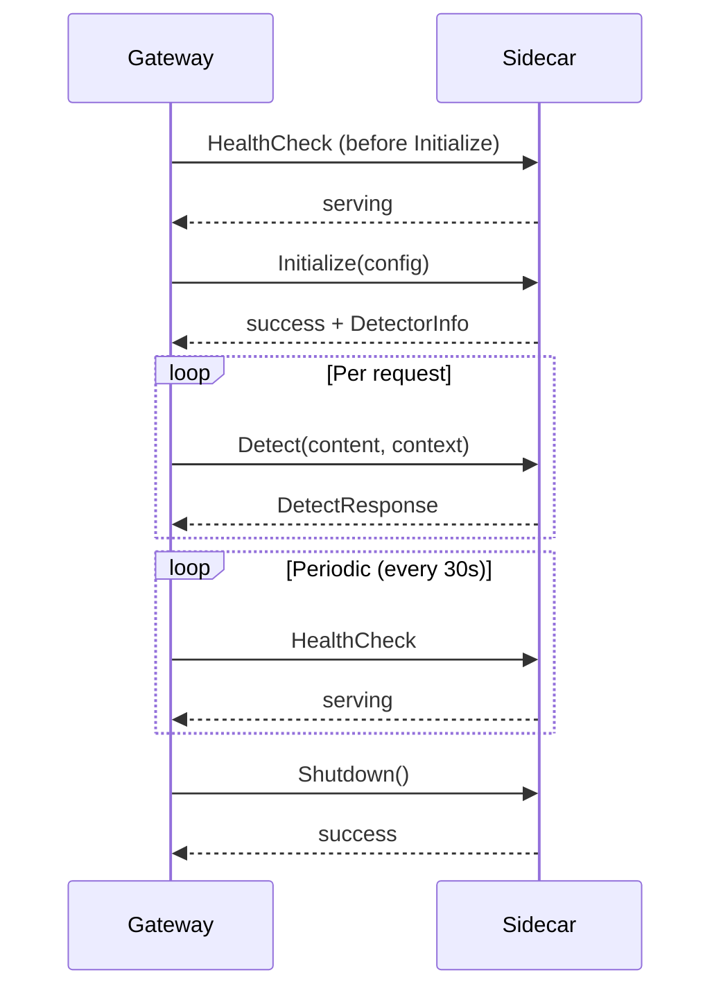

#### 7.3.4 Timeout Handling

gRPC detector calls have a configurable timeout. The timeout resolution order is:

1. **Per-detector `timeout`** (in the detector's YAML config, sibling to `config`) — highest priority
2. **Global `security.timeout.detector`** (see [Section 11.5](#115-timeout-control)) — default fallback

```yaml
detectors:
  input:
    - name: commercial_injection_guard
      type: grpc
      timeout: 3s                   # per-detector override (gateway-internal, NOT passed to detector)
      config:
        endpoint: "localhost:50051"
```

**Important**: `timeout` is a **gateway-internal field** at the detector level (sibling to `config`, not inside `config`). It is NOT passed to the detector via `Initialize()`. Only fields inside `config` are passed through to the detector (see [Section 7.5.1](#751-configuration-passthrough)).

If the gRPC call times out, the detector is marked as errored and its `on_error` strategy is applied. This applies to all detector types (built-in, in-process, gRPC), not just gRPC.

### 7.4 Detector SDK

A separate SDK package (`z-llm-safety-gateway-sdk`) enables third-party detector development without installing the full gateway:

#### 7.4.1 SDK Contents

| Component | Description |
|-----------|-------------|
| `Detector` base class | Abstract interface to implement |
| `DetectionContext` | Context dataclass |
| `DetectionResult` | Result dataclass |
| `Modification` | Modification dataclass (constructed by pipeline engine, not detectors) |
| `test_utils` | Testing utilities: mock context, assertion helpers, test runner |
| `cli` | Scaffolding CLI: `zlg-sdk new my-detector` creates a project template |

#### 7.4.2 SDK Package Structure

```
z_llm_safety_gateway_sdk/
├── pyproject.toml
├── src/
│   └── z_llm_safety_gateway_sdk/
│       ├── __init__.py            # re-exports Detector, DetectionContext, DetectionResult, Modification
│       ├── base.py                # Detector abstract base class
│       ├── context.py             # DetectionContext
│       ├── result.py              # DetectionResult
│       ├── modification.py        # Modification (constructed by pipeline engine)
│       ├── testing.py             # test utilities
│       └── cli.py                 # scaffolding CLI
└── README.md
```

#### 7.4.3 SDK CLI

```bash
# Create a new in-process detector project
zlg-sdk new my-detector --type python

# Create a new gRPC sidecar detector project (Python)
zlg-sdk new my-detector --type grpc --language python

# Create a new gRPC sidecar detector project (Go)
zlg-sdk new my-detector --type grpc --language go

# Validate a detector implementation
zlg-sdk validate ./my-detector

# Run detector tests
zlg-sdk test ./my-detector
```

#### 7.4.4 SDK Versioning

The SDK is versioned independently from the gateway:

- SDK uses Semantic Versioning
- Gateway declares compatibility range: `z-llm-safety-gateway-sdk >= 1.0, < 2.0`
- Breaking changes to the `Detector` interface require a major version bump
- The gateway logs a warning if a plugin's SDK version is outside the compatibility range

### 7.5 Commercial Detector Support

The gateway supports commercial/closed-source detectors through **configuration passthrough**. The gateway does not participate in licensing, billing, or usage metering - these are entirely the detector vendor's responsibility.

#### 7.5.1 Configuration Passthrough

All fields in the detector's `config` section (except gateway-internal fields like `endpoint`, `tls_enabled`, `tls_ca_file`) are passed to the detector via `Initialize()` (gRPC) or `initialize()` (in-process). This includes:

- API keys
- License keys
- Custom sensitivity settings
- Vendor-specific configuration

```yaml
detectors:
  input:
    - name: acme_premium_guard
      enabled: true
      type: grpc
      config:
        endpoint: "acme-detector.svc.cluster.local:50051"
        tls_enabled: true
        tls_ca_file: /app/certs/acme-ca.pem
        # All fields below are passed to the detector:
        api_key: ${ACME_API_KEY}
        license_key: ${ACME_LICENSE_KEY}
        tenant_id: "my-company"
        sensitivity: "high"
```

#### 7.5.2 Vendor Responsibilities

The detector vendor is responsible for:

| Responsibility | Owner |
|----------------|-------|
| Licensing & authentication | Vendor (via `license_key` / `api_key` passed through config) |
| Usage metering & billing | Vendor (detector tracks its own usage) |
| Distribution (Docker image, PyPI package) | Vendor |
| Documentation & support | Vendor |
| Health & performance | Vendor (exposed via gRPC HealthCheck) |

#### 7.5.3 Gateway Responsibilities

The gateway is responsible for:

| Responsibility | Owner |
|----------------|-------|
| Routing requests to the detector | Gateway |
| Timeout enforcement | Gateway |
| Circuit breaker | Gateway |
| Audit logging (detector result, not internals) | Gateway |
| Health check polling | Gateway |
| Failover on error (fail_open/fail_closed) | Gateway |

### 7.6 Plugin Discovery & Installation

#### 7.6.1 In-process Plugins (Python)

```bash
# Install a Python detector package
pip install my-safety-detector

# The gateway auto-discovers it via entry points on next startup
# Enable in gateway.yaml:
#   detectors:
#     input:
#       - name: my_detector
#         enabled: true
```

#### 7.6.2 gRPC Sidecar Plugins

```bash
# Pull and run a detector Docker image
docker run -d \
  --name acme-detector \
  -p 50051:50051 \
  -e ACME_API_KEY=xxx \
  -e ACME_LICENSE_KEY=yyy \
  acme/safety-detector:latest

# Configure in gateway.yaml:
#   detectors:
#     input:
#       - name: acme_premium_guard
#         type: grpc
#         config:
#           endpoint: "localhost:50051"
```

#### 7.6.3 Gateway CLI (Plugin Management)

```bash
# List all available detectors (built-in + discovered plugins)
zlg detectors list

# List enabled detectors
zlg detectors list --enabled

# Show detector details
zlg detectors info prompt_injection

# Test a detector against sample input
zlg detectors test prompt_injection --input "ignore previous instructions"

# Validate gRPC sidecar connection
zlg detectors check-connection acme_premium_guard
```

### 7.7 Plugin Development Documentation

Comprehensive documentation is provided for detector developers:

| Document | Content |
|----------|---------|
| `docs/detector-development.md` | Quick start, Detector interface, config schema, testing |
| `docs/grpc-plugin-guide.md` | Protobuf contract, gRPC server implementation, Docker packaging, TLS |
| `docs/commercial-detectors.md` | Commercial detector distribution, licensing passthrough, best practices |
| `examples/plugins/python_detector/` | Complete in-process Python detector example |
| `examples/plugins/grpc_detector_python/` | Complete gRPC sidecar detector example (Python) |
| `examples/plugins/grpc_detector_go/` | Complete gRPC sidecar detector example (Go) |

---

## 8. Streaming & Response Recall

### 8.1 Streaming Architecture

The gateway supports SSE (Server-Sent Events) streaming, transparently proxying streaming responses from the LLM provider to the client while performing real-time safety checks.

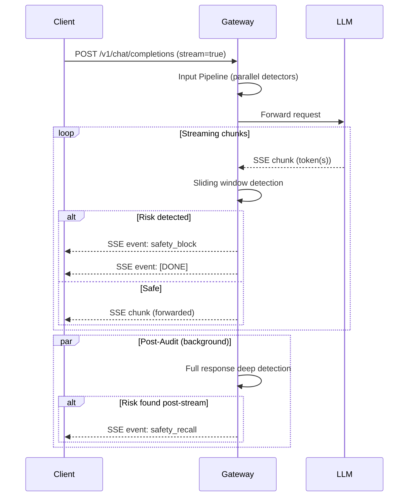

### 8.2 Sliding Window Detection

For output-side streaming, the gateway maintains a sliding window of accumulated tokens:

| Parameter | Description | Default |
|-----------|-------------|---------|
| `window_size` | Detection window size | 200 characters |
| `overlap` | Overlap between consecutive windows | 50 characters |
| `post_audit` | Run full-response deep detection after stream completes | true |

**Window unit**: The MVP uses **character-based** windows (not tokenizer-based) for the following reasons:

- Different providers use different tokenizers (tiktoken, SentencePiece, etc.)
- Character-based counting is tokenizer-agnostic and deterministic
- Chinese characters map roughly 1:1 to tokens, so character-based works well for Chinese
- 200 characters ≈ 50 tokens for English, ≈ 200 tokens for Chinese

**Future enhancement** (v0.2.0+): Pluggable tokenizer support, allowing true token-based windows when the provider's tokenizer is known.

```yaml
pipeline:
  streaming:
    mode: sliding_window          # "sliding_window" (default) | "buffer"
    window_size: 200              # characters per window (MVP)
    # window_unit: chars          # "chars" (default) | "tokens" (future, v0.2.0+)
    # tokenizer: tiktoken         # "tiktoken" | "sentencepiece" | null (future)
    overlap: 50                   # character overlap between windows
    send_flag_events: false       # default: off; send safety_flag SSE events during streaming
    post_audit: true              # full-response deep detection after stream
```

Each window is passed through the output-side detectors. The following actions are possible per window:

| Action | Behavior During Streaming | Rationale |
|--------|--------------------------|-----------|
| `block` | Immediately stop forwarding tokens, send `safety_block` SSE event + `[DONE]` | Prevents further harmful content from reaching client |
| `flag` | Continue streaming; flag recorded in audit log. If `send_flag_events: true`, emit `safety_flag` SSE event | Low-risk content; client should be notified but stream continues |
| `modify` | Treated as `flag` — modification **cannot be applied** (tokens for this window have already been forwarded). Recorded in audit log with `action: "modify"` and `applied: false` | Tokens already sent to client; modification would require recalling and re-sending, which is not supported in sliding-window mode |
| `allow` | Continue streaming normally | No risk detected |

> **`safety_flag` event granularity**: One `safety_flag` SSE event is emitted **per window** (not per detector). If multiple detectors flag the same window, their results are aggregated into a single event — the event includes the highest `risk_level` and a comma-separated `flagged_by` list (e.g., `"flagged_by": "pii_redaction,toxicity"`). This prevents event flooding when many detectors flag simultaneously.

> **Note on `modify` in streaming**: Unlike input-side detection (where `modify` rewrites the request before forwarding) or non-streaming sync output detection (where `modify` rewrites the response before sending), streaming sliding-window detection cannot apply modifications because tokens are forwarded in real-time. If a detector returns `modify` for a window, it is downgraded to `flag` for that window. The full-response post-audit may still detect the same risk and trigger a recall.

**Streaming modes**:

| Mode | Behavior | Use Case |
|------|----------|----------|
| `sliding_window` (default) | Detect on each window as tokens arrive; block mid-stream if risk detected | Real-time protection; minimizes exposure of harmful content |
| `buffer` | Buffer the entire response, run detection once, then send to client | Maximum safety (no partial harmful content sent); adds full detection latency before client receives anything |

> **Buffer mode and post-audit**: In `buffer` mode, the full response is already detected before being sent to the client. Therefore, post-audit is **automatically skipped** when `streaming.mode: buffer` is configured, regardless of the `post_audit` setting. The audit log records `post_audit: {executed: false, reason: "buffer_mode"}`. The `max_response_size` limit still applies during buffering — if the buffered response exceeds `max_response_size`, the `on_max_size` policy (`block` or `truncate`) is triggered before detection runs.

> **Buffer mode SSE delivery**: In `buffer` mode, the client still receives an SSE stream (since `stream=true` was requested). The gateway buffers the full response from the provider, runs detection, and if safe, replays the original SSE chunks to the client. This preserves the SSE protocol contract — the client receives standard `data: {chunk}` events followed by `data: [DONE]`, indistinguishable from a direct (non-buffered) stream. The trade-off is increased time-to-first-token (client waits for the full response to be buffered and detected before receiving any tokens). If detection blocks, the client receives a `safety_block` SSE event + `[DONE]` without any content chunks.

### 8.3 Post-Audit

After the streaming response completes, the gateway runs **post-audit detection** on the full accumulated response. This catches risks that sliding-window detection might miss (e.g., risks that only emerge from the complete context, such as a secret leaked across multiple chunks or toxic content distributed across windows).

| Aspect | Behavior |
|--------|----------|
| **Detectors used** | All enabled output-side detectors (same set as sliding-window detection). The full response is passed as a single `content` string to each detector. |
| **Thresholds** | Same per-detector thresholds as configured for output detection (`block_threshold`, `flag_threshold`). No separate post-audit thresholds in MVP. |
| **Timing** | Runs in the background after the stream has fully completed and `[DONE]` has been sent to the client. Does not block the client connection. |
| **`modify` actions** | Post-audit `modify` results are **not applied** — the response has already been streamed. A `modify` result in post-audit is **downgraded to `flag`**: recorded in the audit log with `original_action: "modify"`, `effective_action: "flag"`, and `applied: false`. This ensures the risk is still tracked even though the modification cannot be applied. Only `block` (triggers recall) and `flag` (recorded in audit) are meaningful in post-audit. |
| **Truncation** | If `on_max_size: truncate` was triggered, post-audit runs on the truncated content. The audit log records `post_audit_truncated: true`. |
| **Disabled detectors** | If `post_audit: false` in streaming config, post-audit is skipped entirely. The audit log records `post_audit.executed: false`. |

### 8.4 Response Recall

If post-audit detection finds a risk in a response that has already been streamed to the client, the gateway sends a **recall signal**:

**SSE Event (default)**:

```
event: safety_recall
data: {"request_id": "req_abc123", "risk_level": "critical", "reason": "Toxic content detected in full response", "category": "toxicity"}
```

**Webhook (optional, requires special configuration)**:

```yaml
pipeline:
  streaming:
    post_audit:
      recall:
        method: sse              # default; "webhook" or "both" for webhook
        webhook_url: ""          # required when method is webhook/both
        webhook_auth_header: ""  # optional auth header for webhook
```

**Recall behavior**:
- Does NOT block subsequent requests in the same session
- Does NOT immediately notify security team
- Records a security finding in the audit log with `severity=critical`

**SSE vs Webhook comparison**:

| Aspect | SSE Event | Webhook |
|--------|-----------|---------|
| Delivery | Same connection as response stream | Separate HTTP POST to configured URL |
| Real-time | Immediate | < 1s (network dependent) |
| Client disconnected | Signal lost | Still deliverable |
| Delivery guarantee | None | Best-effort with retry |
| Client complexity | Low (listen for extra event) | Medium (implement HTTP endpoint) |
| Setup | Zero config | Requires URL + auth config |

**Webhook recall retry policy**: When `recall.method` is `webhook` or `both`, the gateway sends a POST request to the configured `webhook_url`. The retry behavior is:

| Parameter | Value | Description |
|-----------|-------|-------------|
| HTTP method | POST | JSON body with recall payload |
| Timeout | 5s | Max wait for webhook response |
| Success | HTTP 2xx | Any 2xx status code is considered successful |
| Retry count | 3 | Max retries on failure (timeout, 5xx, connection error) |
| Retry backoff | Exponential | 1s, 2s, 4s between retries |
| Auth | `webhook_auth_header` | Optional `Authorization` header value |
| Failure | Logged | If all retries fail, the recall is logged as `recall_delivery: "failed"` in the audit log. No further action. |

> **No persistent queue**: Webhook recalls are not persisted to a queue. If the gateway restarts during retry, the recall is lost. For critical deployments, ensure the webhook endpoint is highly available. A persistent recall queue is planned for v0.2.0+.

### 8.5 Streaming Memory Management

The gateway accumulates the full streaming response for post-audit detection. To prevent memory exhaustion from very long responses:

```yaml
pipeline:
  streaming:
    max_response_size: "1MB"      # max accumulated response size
    on_max_size: "block"           # "block" (send safety_block) | "truncate" (stop accumulating)
```

| Setting | Default | Description |
|---------|---------|-------------|
| `max_response_size` | 1MB | Maximum accumulated response content size |
| `on_max_size` | `block` | `block`: stop streaming, send `safety_block` with reason `response_too_long`. `truncate`: stop accumulating but continue streaming |

When `on_max_size: block` triggers, the gateway sends a `safety_block` SSE event with the following fields:

```
event: safety_block
data: {"request_id":"req_abc123","blocked_by":"streaming_limit","category":"response_too_long","risk_level":"medium","confidence":1.0,"reason":"Response exceeded max_response_size (1MB)"}
```

| Field | Value |
|-------|-------|
| `blocked_by` | `streaming_limit` |
| `category` | `response_too_long` |
| `risk_level` | `medium` |
| `confidence` | `1.0` (deterministic check) |

When `on_max_size: truncate`, post-audit runs on the truncated accumulated content. The audit log records `post_audit_truncated: true`.

---

## 9. LLM Provider Integration

### 9.1 Provider Abstraction

The gateway proxies requests to upstream LLM providers through a provider abstraction layer:

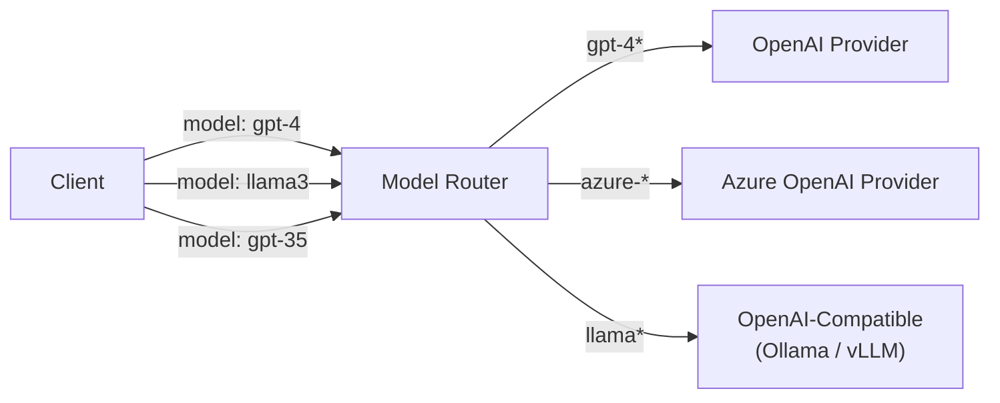

### 9.2 Supported Provider Types (MVP)

| Provider Type | Description | API Format |
|---------------|-------------|------------|
| `openai` | OpenAI API (GPT-4, GPT-3.5, etc.) | OpenAI native |
| `azure_openai` | Azure OpenAI Service | Azure OpenAI format |
| `openai_compatible` | Any OpenAI-compatible endpoint (Ollama, vLLM, LM Studio, etc.) | OpenAI format |

### 9.3 Model Routing

Requests are routed to providers based on the `model` field in the client request:

```yaml
providers:
  - name: openai
    type: openai
    api_key: ${OPENAI_API_KEY}
    base_url: https://api.openai.com/v1

  - name: azure_openai
    type: azure_openai
    api_key: ${AZURE_OPENAI_KEY}
    base_url: https://my-resource.openai.azure.com
    api_version: "2024-06-01"

  - name: local_llama
    type: openai_compatible
    base_url: http://localhost:11434/v1

routing:
  models:
    "gpt-4*": openai
    "gpt-3.5*": openai
    "azure-*": azure_openai
    "llama*": local_llama
```

**Routing rule conflict resolution**: If multiple glob patterns match the same model, the **first match in YAML order** wins. A warning is logged at startup if overlapping patterns are detected.

### 9.4 Provider Failover (v0.2.0+)

MVP does not support provider failover. Planned for v0.2.0:

```yaml
routing:
  models:
    "gpt-4*":
      primary: openai
      fallback: azure_openai      # used if primary is unavailable
      fallback_timeout: 10s       # time before switching to fallback
```

### 9.5 API Version Compatibility

Each provider type manages its own API versioning:

| Provider Type | Version Handling |
|---------------|-----------------|
| `openai` | Uses latest stable OpenAI API; version not configurable (follows OpenAI's deprecation) |
| `azure_openai` | `api_version` parameter in provider config (e.g., `"2024-06-01"`) |
| `openai_compatible` | Follows the upstream service's API version |

The gateway forwards provider-specific parameters (e.g., Azure's `api-version` query parameter) transparently. Provider-specific request/response transformations are handled in the provider adapter.

### 9.6 Future Providers

| Provider | Target Version | Notes |
|----------|---------------|-------|
| Anthropic Claude | v0.3.0 | Requires API format conversion |
| Google Gemini | v0.3.0 | Requires API format conversion |
| AWS Bedrock | v0.4.0 | Multiple model families |

### 9.7 Provider Error Handling

When the upstream LLM provider returns an error, the gateway wraps it in an OpenAI-compatible error response:

| Provider Error | Gateway Response | Behavior |
|----------------|-----------------|----------|
| Provider timeout (exceeds `security.timeout.upstream`) | HTTP 502 `provider_error` | Gateway aborts the upstream request, returns error to client |
| Provider 4xx (e.g., 400, 401, 403) | HTTP 502 `provider_error` | Gateway wraps provider error; original status code and message included in `details` |
| Provider 429 (rate limited) | HTTP 502 `provider_error` | Gateway does not retry; client should back off. `Retry-After` from provider is forwarded if present |
| Provider 5xx (e.g., 500, 502, 503) | HTTP 502 `provider_error` | Gateway does not retry in MVP; provider failover planned for v0.2.0 |
| Provider network error (connection refused, DNS failure) | HTTP 502 `provider_error` | Gateway returns generic error; details logged for debugging |
| Provider streaming error (mid-stream) | SSE `error` event + `[DONE]` | Gateway sends a standard SSE error event and closes the stream |

```json
{
  "error": {
    "message": "Upstream provider error: Connection timed out",
    "type": "provider_error",
    "param": null,
    "code": "provider_error",
    "details": {
      "provider": "openai",
      "provider_status": null,
      "provider_message": "Connection timed out"
    }
  }
}
```

> **No retry in MVP**: The gateway does not retry failed provider requests. Retrying could duplicate side effects (e.g., duplicate billing, non-idempotent operations). Provider failover (v0.2.0+) will handle this via configured fallback providers.

### 9.8 `/v1/models` Passthrough

The `/v1/models` endpoint lists available models. The gateway forwards this request to the **first configured provider** and returns the response as-is. In MVP:

- No model aggregation across providers (only the first provider's model list is returned)
- No input/output detection (detection column: None)
- Authentication is still required (API key validation applies)
- Rate limiting applies
- A future enhancement (v0.2.0+) may aggregate models from all configured providers and filter by routing rules

---

## 10. Configuration System

### 10.1 Configuration Approach

- **Format**: YAML configuration file
- **Override**: Environment variables (for secrets and deployment-specific values)
- **Hot reload**: Not supported (restart required for config changes)
- **Validation**: Pydantic v2 schema validation on load

### 10.2 Full Configuration Example

```yaml
# gateway.yaml - z LLM Safety Gateway Configuration

server:
  host: 0.0.0.0
  port: 8080
  workers: 4
  stop_timeout: 30s             # graceful shutdown timeout

# --- LLM Providers ---
providers:
  - name: openai
    type: openai
    api_key: ${OPENAI_API_KEY}
    base_url: https://api.openai.com/v1

  - name: local_llama
    type: openai_compatible
    base_url: http://localhost:11434/v1

routing:
  models:
    "gpt-4*": openai
    "gpt-3.5*": openai
    "llama*": local_llama

# --- Pipeline Engine ---
pipeline:
  execution_mode: parallel        # "parallel" (MVP only); "sequential" planned for v0.2.0+
  short_circuit_on: block         # "block" (default) | "block_and_modify"
  flag_escalation:
    enabled: false
    rule: "count >= 3 and max_risk_level >= medium"
    action: block

  output_detection:
    mode: sync                    # "sync" (default) | "async"
    sync_timeout: 5s              # max wait for output detection in sync mode
    recall:                       # used only when mode=async
      webhook_url: ""             # required when mode=async
      webhook_auth_header: ""     # optional auth header for webhook

  streaming:
    mode: sliding_window          # "sliding_window" (default) | "buffer"
    window_size: 200              # characters per window (MVP)
    overlap: 50                   # character overlap between windows
    send_flag_events: false       # default: off; send safety_flag SSE events during streaming
    max_response_size: "1MB"      # max accumulated response for post-audit
    on_max_size: block            # "block" | "truncate"
    post_audit: true              # full-response deep detection after stream
    recall:
      method: sse                 # "sse" (default) | "webhook" | "both"
      webhook_url: ""
      webhook_auth_header: ""

# --- Detectors ---
detectors:
  input:
    - name: prompt_injection
      enabled: true
      priority: 100
      config:
        block_threshold: 0.85
        flag_threshold: 0.50
      on_error: fail_open

    - name: pii_redaction
      enabled: true
      priority: 10                # applied first (before other modifications)
      config:
        entity_types: [email, phone, ssn, credit_card, ip_address]
        redaction_mode: mask      # "mask" | "replace" | "hash"
      on_error: fail_closed

    - name: toxicity
      enabled: true
      priority: 100
      config:
        model_name: "unitary/toxic-bert"
        model_version: "v1.0"          # HuggingFace revision; omit for latest
        model_cache_dir: "/app/models"
        offline_mode: false
        block_threshold: 0.90
        flag_threshold: 0.60
      on_error: fail_open

    - name: sensitive_words
      enabled: true
      priority: 20
      config:
        word_list_file: config/wordlists/sensitive_en.txt
        word_list_file_zh: config/wordlists/sensitive_zh.txt
        match_mode: exact         # "exact" | "fuzzy"
      on_error: fail_open

    # Example: third-party gRPC detector
    - name: acme_injection_guard
      enabled: false
      type: grpc
      priority: 30
      config:
        endpoint: "localhost:50051"
        tls_enabled: false
        api_key: ${ACME_API_KEY}
        license_key: ${ACME_LICENSE_KEY}
      on_error: fail_open
      circuit_breaker:
        enabled: true
        failure_threshold: 5
        recovery_timeout: 30s
        fallback_action: fail_open

  output:
    - name: toxicity
      enabled: true
      priority: 100
      config:
        model_name: "unitary/toxic-bert"  # same model as input toxicity
        model_version: "v1.0"             # same version as input
        model_cache_dir: "/app/models"    # same cache dir as input
        offline_mode: false
        block_threshold: 0.90
        flag_threshold: 0.60
      on_error: fail_open

    - name: secret_leak
      enabled: true
      priority: 10
      config:
        patterns: [api_key, aws_secret, private_key, jwt_token]
      on_error: fail_closed

# --- Security ---
security:
  auth:
    enabled: true
    api_keys:
      - key: ${GATEWAY_API_KEY_1}
        name: "app-1"
      - key: ${GATEWAY_API_KEY_2}
        name: "app-2"

  tls:
    enabled: false                # use reverse proxy for TLS in production
    cert_file: ""
    key_file: ""

  rate_limit:
    enabled: true
    strategy: token_bucket
    rate: 100                     # requests per second
    burst: 200                    # burst capacity
    per: api_key                  # "api_key" | "ip"
    storage: memory               # "memory" (MVP) | "redis" (v0.2.0+, for multi-instance)

  max_request_size: "10MB"

  timeout:
    upstream: 120s                # LLM provider timeout
    detector: 5s                  # per-detector timeout

  cors:
    enabled: false
    origins: []

  request_id:
    header: "X-Request-ID"        # accept client-provided request ID
    generate: true                # generate UUID v4 if not provided

# --- Audit & Logging ---
audit:
  enabled: true
  store_content: false            # store original content? (privacy: default false)
  sanitize_logs: true             # redact API keys, auth headers from logs
  file:
    enabled: true
    path: /var/log/safety-gateway
    rotation: daily
    retention_days: 90
  stdout: true                    # structured JSON to stdout for external collectors

logging:
  level: INFO                     # DEBUG | INFO | WARNING | ERROR
  format: json                    # "json" (default) | "text"

# --- Observability ---
observability:
  metrics:
    enabled: true
    endpoint: /metrics            # Prometheus metrics endpoint
  tracing:
    enabled: false
    exporter: otlp                # "otlp" | "jaeger" | "zipkin"
    endpoint: ""                  # OTLP collector endpoint
    sample_rate: 0.1              # 10% of requests traced

# --- Detector Model Cache ---
model_cache:
  dir: ~/.cache/z_llm_safety_gateway/models/
  offline_mode: false             # true = never download models, fail if not cached
```

### 10.3 Environment Variable Override

Any configuration value can be overridden via environment variables using the `${VAR_NAME}` syntax in YAML. This is primarily used for secrets (API keys) and deployment-specific values.

### 10.4 Configuration Validation Rules

The gateway validates configuration at startup. Invalid configuration prevents startup with a clear error message.

| Validation Rule | Error Level | Message |
|-----------------|-------------|---------|
| Unknown detector name (not built-in, no entry point, not gRPC type) | Error | `Unknown detector 'xxx'. Available: [list]. For third-party detectors, ensure the package is installed or use type: grpc.` |
| Missing `word_list_file` when referenced | Error | `Detector 'sensitive_words' references missing file: config/wordlists/sensitive_en.txt` |
| `block_threshold` <= `flag_threshold` | Error | `Detector 'xxx': block_threshold (0.50) must be greater than flag_threshold (0.85)` |
| Overlapping routing rules | Warning | `Routing rules 'gpt-4*' and 'gpt-*' overlap for model 'gpt-4'. First match 'gpt-4*' will be used.` |
| Missing required provider config (e.g., no `api_key` for OpenAI) | Error | `Provider 'openai' is missing required field: api_key` |
| gRPC detector missing `endpoint` | Error | `gRPC detector 'xxx' is missing required config: endpoint` |
| No routing rule for model in request | Warning (runtime) | `No routing rule matches model 'xxx'. Returning 404.` |
| `max_response_size` invalid format | Error | `Invalid max_response_size 'abc'. Expected format like '1MB', '512KB'.` |
| Webhook recall method without `webhook_url` | Error | `Recall method 'webhook' requires webhook_url to be configured` |
| Detector with `type: grpc` but no `circuit_breaker` | Info | `gRPC detector 'xxx' has no circuit_breaker configured. Recommended for external detectors.` |
| `output_detection.mode: async` without `recall.webhook_url` configured | Warning | `Output detection mode 'async' without recall.webhook_url configured. Post-response risks cannot be communicated to client. Set pipeline.output_detection.recall.webhook_url.` |
| `flag_escalation.enabled: true` with invalid `rule` syntax | Error | `Invalid flag_escalation rule syntax: <details>. Supported: count, max_risk_level, categories with >=, >, ==, !=, and, or.` |
| `streaming.mode: buffer` with `post_audit: true` | Info | `Streaming mode 'buffer' with post_audit: true. Post-audit is automatically skipped in buffer mode (full detection already runs before sending).` |

---

## 11. Security Design

### 11.1 Authentication

API Key-based authentication. Clients must include an API key in the `Authorization` header:

```
Authorization: Bearer <gateway-api-key>
```

The gateway validates the key against the configured list before processing any request.

### 11.2 TLS

The gateway supports native TLS termination. In production, it is recommended to use a reverse proxy (Nginx, HAProxy, cloud load balancer) for TLS termination and let the gateway handle HTTP internally.

### 11.3 Rate Limiting

Token bucket algorithm with configurable rate and burst. Limiting scope can be per API Key or per client IP.

#### Rate Limit Response

When rate limit is exceeded:

```json
HTTP 429 Too Many Requests

Headers:
  Retry-After: 2
  X-RateLimit-Limit: 100
  X-RateLimit-Remaining: 0
  X-RateLimit-Reset: 1723286400

Body:
{
  "error": {
    "message": "Rate limit exceeded. Retry after 2 seconds.",
    "type": "rate_limit_error",
    "code": "rate_limit_exceeded"
  }
}
```

#### Rate Limit Storage

| Storage | Scope | Multi-instance | Target Version |
|---------|-------|----------------|----------------|
| `memory` (default) | Single instance | No | MVP |
| `redis` | Multi-instance | Yes | v0.2.0+ |

For MVP, rate limiting uses in-memory storage. This is sufficient for single-instance deployment. For multi-instance Docker Compose or K8s deployments, Redis backend will be added in v0.2.0.

### 11.4 Request Size Limit

Maximum request body size to prevent abuse (default: 10MB).

### 11.5 Timeout Control

| Timeout | Scope | Default | Override |
|---------|-------|---------|----------|
| `upstream` | Waiting for LLM provider response | 120s | Per-provider config |
| `detector` | Individual detector execution (all types) | 5s | Per-detector `timeout` field (see [Section 7.3.4](#734-timeout-handling)) |

The per-detector `timeout` field (sibling to `config` in detector YAML) overrides the global `security.timeout.detector` for that specific detector. If not set, the global default applies.

### 11.6 CORS

Optional CORS support for browser-based applications that call the gateway directly.

### 11.7 Request ID Generation & Propagation

Each request is assigned a unique identifier for tracing and correlation:

| Aspect | Behavior |
|--------|----------|
| **Generation** | UUID v4 generated by gateway at request entry |
| **Client-provided** | If `X-Request-ID` header is present in the request, use it instead of generating |
| **Sanitization** | Client-provided IDs are sanitized: max 128 characters, alphanumeric + hyphen/underscore only (`^[a-zA-Z0-9_-]{1,128}$`). Invalid IDs are discarded and a new UUID v4 is generated. This prevents log injection (newline/control characters breaking JSONL) and header injection. |
| **Propagation** | Returned in response header `X-Request-ID` |
| **Audit logs** | Included in every audit log entry |
| **SSE events** | Included in `safety_block`, `safety_recall`, `safety_flag` events |
| **Metrics** | Not included (metrics are aggregated, not per-request) |
| **Tracing** | Used as span name attribute in OpenTelemetry |

### 11.8 Log Sanitization

To prevent sensitive data leakage through logs:

| Data | Handling |
|------|----------|
| `Authorization` header | Redacted in all logs (`Authorization: Bearer ***`) |
| API keys (config values) | Never logged in plaintext |
| User content | Controlled by `audit.store_content` (default: `false`); content hash always stored |
| Provider API keys | Never logged, never included in error responses |
| gRPC detector `api_key` / `license_key` | Redacted in logs (`api_key: ***`) |

When `audit.sanitize_logs: true` (default), the gateway redacts known sensitive patterns (API keys, bearer tokens) from all log output as a safety net.

### 11.9 Future Security Features

| Feature | Target Version |
|---------|---------------|
| mTLS (mutual TLS) | v0.2.0 |
| RBAC (role-based access control) | v0.2.0 |
| OAuth 2.0 integration | v0.3.0 |
| Redis-backed rate limiting (multi-instance) | v0.2.0 |

---

## 12. Audit, Logging & Observability

### 12.1 Audit Log Format

Each request generates an audit log entry in JSONL format. The gateway writes **one audit entry per direction** (input and output are separate entries, linked by `request_id`):

```json
{
  "request_id": "req_abc123",
  "timestamp": "2026-08-10T12:00:00.000Z",
  "direction": "input",
  "user_id": "user_001",
  "model": "gpt-4",
  "provider": "openai",
  "content_hash": "sha256:a1b2c3d4...",
  "content_length": 1250,
  "language": "en",
  "detectors": [
    {
      "name": "prompt_injection",
      "action": "block",
      "confidence": 0.92,
      "risk_level": "critical",
      "duration_ms": 15,
      "error": null
    },
    {
      "name": "pii_redaction",
      "action": "flag",
      "confidence": 0.60,
      "risk_level": "medium",
      "duration_ms": 8,
      "error": null
    }
  ],
  "final_action": "block",
  "final_risk_level": "critical",
  "pipeline_duration_ms": 23,
  "total_duration_ms": 28,
  "streaming": false,
  "post_audit": null,
  "recalled": false
}
```

**Field definitions**:

| Field | Description |
|-------|-------------|
| `direction` | `"input"` or `"output"`. Input and output detection generate **separate** audit entries, both linked by the same `request_id`. |
| `pipeline_duration_ms` | Time spent in the detection pipeline (all detectors in parallel). Excludes content extraction, modification, and provider call. |
| `total_duration_ms` | Total processing time for this audit entry's phase. For **input** entries: from request entry to input pipeline completion (block response sent or request forwarded to provider). For **output** entries: from LLM response received to output response sent to client (block response, modified response, or unmodified response). Excludes LLM provider latency. |
| `detectors` (streaming) | For streaming output entries, the `detectors` array contains the **post-audit** results (full-response detection), not per-window results. Per-window block/flag events are recorded as separate fields (`window_count`, sliding-window blocks are counted but individual window results are not logged in detail to avoid excessive log volume). |
| `content_hash` (streaming) | SHA-256 hash of the full accumulated streaming response. |
| `async_detection` | Only present in non-streaming async output detection. `"pending"` in the initial entry (response sent, detection not yet complete); `"completed"` in the completion entry (detection finished, full results included). Absent in sync mode and streaming mode. |

**Streaming-specific fields** (only present when `streaming: true`):

```json
{
  "streaming": true,
  "window_count": 12,
  "post_audit": {
    "executed": true,
    "result": "block",
    "category": "toxicity",
    "risk_level": "critical"
  },
  "post_audit_truncated": false,
  "recalled": true,
  "recall_method": "sse"
}
```

| Streaming Field | Description |
|-----------------|-------------|
| `window_count` | Number of sliding-window detection cycles performed during streaming |
| `post_audit` | Post-audit result object. `{"executed": false}` when post-audit is disabled or skipped (buffer mode). `{"executed": true, "result": ..., "category": ..., "risk_level": ...}` when post-audit ran. |
| `post_audit_truncated` | `true` if `on_max_size: truncate` was triggered before post-audit (post-audit ran on truncated content). `false` or absent otherwise. |
| `recalled` | `true` if post-audit found a risk and a recall signal was sent |
| `recall_method` | `"sse"`, `"webhook"`, or `"both"` — how the recall was delivered. `null` if not recalled. |

### 12.2 Content Storage Policy

| Setting | Default | Description |
|---------|---------|-------------|
| `store_content` | `false` | Store original request/response content in audit log |
| `content_hash` | Always stored | SHA-256 hash of content for tracing without storing plaintext |

When `store_content: false` (default), only the content hash is stored. This protects privacy and reduces storage costs. Enterprises can enable content storage for debugging purposes.

### 12.3 Log Output Channels

| Channel | Format | Purpose |
|---------|--------|---------|
| **JSONL file** | JSON Lines, daily rotation | Local audit trail, compliance retention |
| **stdout** | Structured JSON | Container-native logging, picked up by external collectors (Fluentd, Vector, Filebeat) for forwarding to enterprise log systems (Alibaba SLS, Azure Monitor, AWS CloudWatch, ELK Stack) |

### 12.4 Log Forwarding Architecture

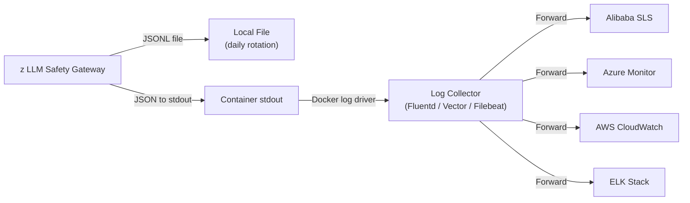

No built-in exporters for specific cloud log services. The gateway outputs structured JSON to stdout; users deploy their preferred log collector to forward to any destination.

### 12.5 Prometheus Metrics

The gateway exposes Prometheus-format metrics at `/metrics`:

#### Gateway Metrics

| Metric | Type | Labels | Description |
|--------|------|--------|-------------|
| `safety_gateway_requests_total` | Counter | `direction`, `action`, `model` | Total requests processed |
| `safety_gateway_request_duration_seconds` | Histogram | `direction`, `model` | Request processing duration |
| `safety_gateway_blocks_total` | Counter | `direction`, `category`, `detector_name` | Total blocked requests |
| `safety_gateway_flags_total` | Counter | `direction`, `category`, `detector_name` | Total flagged requests |
| `safety_gateway_active_connections` | Gauge | - | Current active connections |
| `safety_gateway_streaming_active` | Gauge | - | Current active streaming connections |

#### Detector Metrics

| Metric | Type | Labels | Description |
|--------|------|--------|-------------|
| `safety_detector_duration_seconds` | Histogram | `detector_name`, `direction` | Detector execution duration |
| `safety_detector_results_total` | Counter | `detector_name`, `action` | Detector result counts |
| `safety_detector_errors_total` | Counter | `detector_name`, `error_type` | Detector error counts |
| `safety_detector_circuit_breaker_state` | Gauge | `detector_name` | Circuit breaker state (0=closed, 1=open, 2=half-open) |

#### Provider Metrics

| Metric | Type | Labels | Description |
|--------|------|--------|-------------|
| `safety_provider_requests_total` | Counter | `provider`, `model` | Total provider requests |
| `safety_provider_duration_seconds` | Histogram | `provider`, `model` | Provider response duration |
| `safety_provider_errors_total` | Counter | `provider`, `error_type` | Provider error counts |

#### Recall Metrics

| Metric | Type | Labels | Description |
|--------|------|--------|-------------|
| `safety_recalls_total` | Counter | `category`, `risk_level` | Total post-audit recalls |

### 12.6 OpenTelemetry Tracing

Optional distributed tracing via OpenTelemetry:

```yaml
observability:
  tracing:
    enabled: false                # default: off
    exporter: otlp                # "otlp" | "jaeger" | "zipkin"
    endpoint: "http://otel-collector:4317"
    sample_rate: 0.1              # 10% of requests traced
```

**Trace spans**:

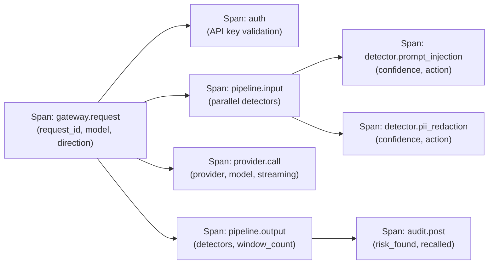

- Trace context propagated via W3C TraceContext headers (`traceparent`, `tracestate`)
- Client-provided trace context is respected and continued
- Each span includes relevant attributes (detector name, confidence, action, duration)

---

## 13. Deployment

### 13.1 Docker (Single Container)

```dockerfile
FROM python:3.12-slim

WORKDIR /app

COPY pyproject.toml .
COPY src/ src/
COPY config/ config/
RUN pip install --no-cache-dir .

EXPOSE 8080

HEALTHCHECK --interval=30s --timeout=3s --retries=3 \
  CMD curl -f http://localhost:8080/health || exit 1

CMD ["python", "-m", "z_llm_safety_gateway.server"]
```

**Running**:

```bash
docker run -d \
  --name safety-gateway \
  -p 8080:8080 \
  -v $(pwd)/config/gateway.yaml:/app/config/gateway.yaml \
  -v $(pwd)/logs:/var/log/safety-gateway \
  -e OPENAI_API_KEY=sk-xxx \
  -e GATEWAY_API_KEY_1=gw-xxx \
  z-llm-safety-gateway:latest
```

### 13.2 Docker Compose (Production)

```yaml
# docker-compose.yml
version: "3.9"

services:
  safety-gateway:
    image: z-llm-safety-gateway:latest
    build: .
    ports:
      - "8080:8080"
    volumes:
      - ./config/gateway.yaml:/app/config/gateway.yaml:ro
      - ./logs:/var/log/safety-gateway
      - ./config/wordlists:/app/config/wordlists:ro
    environment:
      - OPENAI_API_KEY=${OPENAI_API_KEY}
      - GATEWAY_API_KEY_1=${GATEWAY_API_KEY}
    deploy:
      replicas: 3
      resources:
        limits:
          cpus: "2.0"
          memory: 2G
        reservations:
          cpus: "0.5"
          memory: 512M
      restart_policy:
        condition: on-failure
        max_attempts: 3
    healthcheck:
      test: ["CMD", "curl", "-f", "http://localhost:8080/health"]
      interval: 30s
      timeout: 3s
      retries: 3
    logging:
      driver: json-file
      options:
        max-size: "100m"
        max-file: "5"
    stop_grace_period: 35s        # must be > server.stop_timeout (30s) to allow full graceful shutdown

  # Example: gRPC sidecar detector
  acme-detector:
    image: acme/safety-detector:latest
    environment:
      - ACME_API_KEY=${ACME_API_KEY}
      - ACME_LICENSE_KEY=${ACME_LICENSE_KEY}
    healthcheck:
      test: ["CMD", "grpc_health_probe", "-addr=localhost:50051"]
      interval: 30s
      timeout: 3s
      retries: 3
    restart: unless-stopped
```

**Horizontal scaling**: Scale by increasing `deploy.replicas` or running multiple containers behind a load balancer. The gateway is stateless - any instance can handle any request.

### 13.3 Health Check Endpoints

| Endpoint | Method | Purpose | Response |
|----------|--------|---------|----------|
| `/health` | GET | Pure liveness probe; detector/provider health is deliberately excluded | `{"status": "healthy"}` (always HTTP 200 while the process serves requests) |
| `/ready` | GET | App-scoped readiness with bounded parallel detector health checks | HTTP 200 for healthy or fail-open degraded instances; HTTP 503 for any required/fail-closed issue |
| `/metrics` | GET | Prometheus metrics | Prometheus format |

**`/ready` health logic**:

| Detector State | Policy | `/ready` Result | Business admission |
|----------------|--------|-----------------|--------------------|
| Healthy | any | HTTP 200 | Detector executes normally |
| Unavailable/unhealthy | required or `fail_closed` | HTTP 503 `not_ready` | HTTP 503 `safety_detector_unavailable` before Provider routing |
| Unavailable/unhealthy | optional `fail_open` | HTTP 200 `ready`, `degraded: true` | Faulted detector is excluded from sync, async, streaming, and post-audit execution |

The readiness response contains deterministic aggregate counts and an `issues`
array with `name`, `direction`, `state`, and a stable `reason_code` when one is
available. Raw exception text, endpoints, and credentials are never exposed.

> **Load balancer consideration**: When using `/ready` for load balancing, `fail_open` detector failures do not remove the gateway from the pool. Only `fail_closed` detector failures trigger HTTP 503 and pool removal.

### 13.4 Graceful Shutdown

The gateway handles `SIGTERM`/`SIGINT` for zero-downtime deployment:

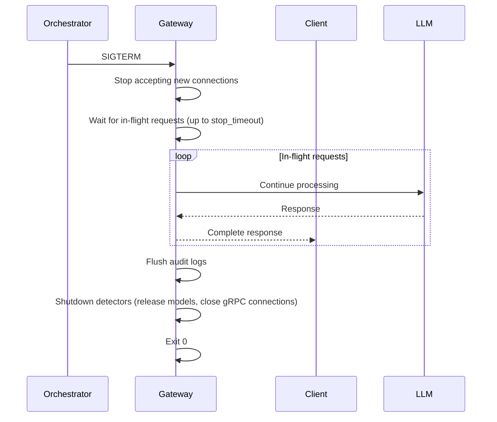

| Setting | Default | Description |
|---------|---------|-------------|
| `server.stop_timeout` | 30s | Max time to wait for in-flight requests before forcing exit |
| Docker `stop_grace_period` | 35s | Must be **greater than** `server.stop_timeout` to prevent Docker from sending SIGKILL before graceful shutdown completes. Recommended: `stop_timeout + 5s`. |
| Streaming connections | Closed gracefully | Send `data: [DONE]` and close SSE stream |

```yaml
server:
  host: 0.0.0.0
  port: 8080
  workers: 4
  stop_timeout: 30s             # graceful shutdown timeout
```

### 13.5 gRPC Sidecar Deployment

For gRPC-based third-party detectors, the sidecar runs as a separate container:

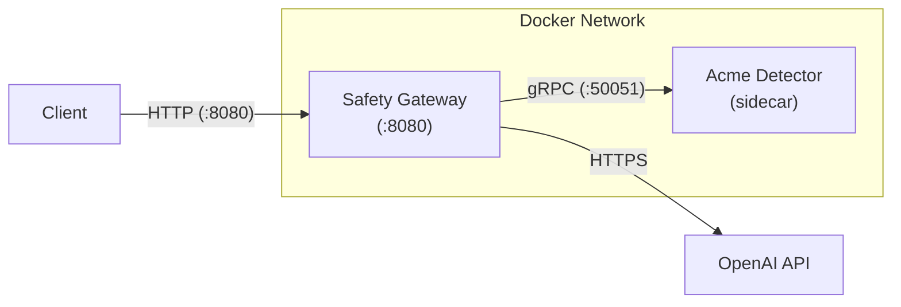

**Best practices**:
- Run sidecar on the same host or Docker network for lowest latency
- Use Docker health checks with `grpc_health_probe`
- Configure circuit breaker on the gateway side
- Sidecar should implement graceful shutdown on SIGTERM

### 13.6 Kubernetes (Future - v0.2.0+)

K8s support requires the following additional work:

| Work Item | Description |
|-----------|-----------|
| Helm Chart | Chart templates (Deployment, Service, ConfigMap, Secret, HPA) |
| Health probes | K8s-native liveness/readiness probe configuration |
| HPA | HorizontalPodAutoscaler based on CPU or custom metrics |
| Graceful shutdown | SIGTERM handling for zero-downtime rolling updates |
| Config injection | ConfigMap for YAML config, Secret for API keys |
| Ingress | TLS termination and routing templates |
| Sidecar deployment | K8s sidecar container pattern for gRPC detectors |

The gateway's stateless design means K8s migration is primarily templating and documentation work - no architectural changes needed.

---

## 14. Performance Targets

### 14.1 Detection Latency

Since detectors run in parallel, pipeline latency = max(all detector latencies). Targets are split by detector mix:

| Metric | Target | Conditions |
|--------|--------|------------|
| P50 detection latency (rule-based only) | < 5ms | All input detectors, parallel, rule-based only (regex, keyword, Aho-Corasick) |
| P95 detection latency (rule-based only) | < 10ms | Same as above |
| P50 detection latency (rule-based + ML) | < 50ms | All input detectors, parallel, includes ML-based (e.g., toxicity) |
| P95 detection latency (rule-based + ML) | < 100ms | Same as above |
| P99 detection latency (any mix) | < 200ms | All input detectors, parallel |
| Single rule-based detector | < 1ms | Regex/keyword matching |
| Single ML-based detector | 10-50ms | CPU inference, small model |
| LLM-as-Judge detector | 200-500ms | External LLM call (not in MVP detector mix by default) |
| gRPC sidecar overhead | 1-5ms | Local network, localhost |

### 14.2 Streaming Overhead

| Metric | Target | Description |
|--------|--------|-------------|
| Per-window detection overhead | < 5ms | Sliding window detection per window |
| Per-chunk forwarding overhead | < 1ms | SSE chunk passthrough (no detection) |
| Post-audit completion | < 500ms after stream end | Full-response deep detection |

### 14.3 Throughput

| Metric | Target | Conditions |
|--------|--------|------------|
| Requests per second | 1000 req/s | Single instance, rule-based detectors only |
| Requests per second | 200 req/s | Single instance, with ML-based detectors |
| Streaming concurrent connections | 500 | Per instance |

### 14.4 Resource Usage

| Metric | Target | Conditions |
|--------|--------|------------|
| Baseline memory | < 256MB | No ML models loaded |
| Memory with ML models | < 1GB | Toxicity model loaded |
| Startup time (cold) | < 5s | Without ML model download |
| Startup time (warm) | < 2s | Models cached, no download |

### 14.5 Benchmark Methodology

The `tests/benchmarks/bench_pipeline.py` script provides standardized benchmarks:

```bash
# Run full benchmark suite
python -m tests.benchmarks.bench_pipeline --suite all

# Benchmark specific detector
python -m tests.benchmarks.bench_pipeline --detector prompt_injection --iterations 10000

# Benchmark streaming pipeline
python -m tests.benchmarks.bench_pipeline --suite streaming --concurrent 100
```

Benchmark results are reported as:
- Latency percentiles (P50, P75, P90, P95, P99)
- Throughput (requests/second)
- Memory usage (peak RSS)
- Per-detector breakdown

---

## 15. Technology Stack

| Component | Choice | Rationale |
|-----------|--------|-----------|
| Language | Python 3.12+ | AI/ML ecosystem alignment, async support |
| Web framework | FastAPI | Async-native, high performance, auto OpenAPI docs |
| Config validation | Pydantic v2 | Type-safe config, FastAPI integration |
| HTTP client | httpx | Async HTTP client, streaming support |
| Structured logging | structlog | JSON structured output for container environments |
| PII detection | Microsoft Presidio | Mature, extensible PII detection library |
| ML models (optional) | transformers (HuggingFace) | For ML-based detectors (toxicity, etc.) |
| Language detection | langdetect | Lightweight, Python-native language identification |
| Pattern matching | pyahocorasick | Efficient multi-pattern matching for sensitive words |
| gRPC (sidecar) | grpcio + protobuf | gRPC sidecar detector support |
| Metrics | prometheus-client | Prometheus metrics endpoint |
| Tracing | opentelemetry-sdk | OpenTelemetry distributed tracing |
| Testing | pytest + pytest-asyncio | Python standard, async test support |
| Linting | ruff | Fast, replaces flake8/black/isort |
| Type checking | mypy | Static type safety |
| Containerization | Docker + Docker Compose | Confirmed for MVP |
| License | Apache 2.0 | Industry standard, commercial-friendly |

### 15.1 SDK Dependencies

The Detector SDK (`z-llm-safety-gateway-sdk`) has minimal dependencies:

| Dependency | Purpose |
|------------|---------|
| pydantic v2 | Data models (DetectionResult, DetectionContext) |
| (no FastAPI, no httpx, no ML libraries) | SDK is lightweight, only for detector development |

---

## 16. Project Structure

```
z_llm_safety_gateway/
├── README.md
├── LICENSE                          # Apache 2.0
├── pyproject.toml                   # project metadata + dependencies
├── Dockerfile
├── docker-compose.yml
├── .github/
│   └── workflows/
│       └── ci.yml                   # CI pipeline (lint, test, build)
├── proto/
│   └── detector.proto               # gRPC detector plugin contract
├── config/
│   ├── gateway.yaml                 # default config example
│   └── wordlists/
│       ├── sensitive_en.txt         # English sensitive words
│       └── sensitive_zh.txt         # Chinese sensitive words
├── src/
│   └── z_llm_safety_gateway/
│       ├── __init__.py
│       ├── server.py                # FastAPI app entry point
│       ├── config.py                # config loading & validation (Pydantic)
│       │
│       ├── pipeline/
│       │   ├── __init__.py
│       │   ├── engine.py            # parallel pipeline + short-circuit logic
│       │   ├── context.py           # DetectionContext (re-exported from SDK)
│       │   ├── result.py            # aggregation logic only (DetectionResult re-exported from SDK)
│       │   └── circuit_breaker.py   # circuit breaker for external detectors
│       │
│       ├── detectors/
│       │   ├── __init__.py
│       │   ├── base.py              # Detector base class (re-exported from SDK for built-in detectors)
│       │   ├── registry.py          # detector registry & discovery
│       │   ├── prompt_injection.py
│       │   ├── pii_redaction.py
│       │   ├── toxicity.py
│       │   ├── sensitive_words.py
│       │   └── secret_leak.py
│       │
│       ├── plugins/
│       │   ├── __init__.py
│       │   ├── loader.py            # plugin loading (entry points + gRPC)
│       │   ├── grpc_client.py       # gRPC sidecar client
│       │   └── health.py            # plugin health checking
│       │
│       ├── providers/
│       │   ├── __init__.py
│       │   ├── base.py              # Provider abstract base class
│       │   ├── openai_provider.py
│       │   ├── azure_openai.py
│       │   └── openai_compatible.py
│       │
│       ├── proxy/
│       │   ├── __init__.py
│       │   ├── handler.py           # request proxy handler
│       │   ├── content_extractor.py # extract content from OpenAI requests
│       │   ├── streaming.py         # SSE streaming + sliding window
│       │   └── recall.py            # response recall logic
│       │
│       ├── audit/
│       │   ├── __init__.py
│       │   ├── logger.py            # JSONL audit logger
│       │   └── stdout.py            # structured stdout output
│       │
│       ├── observability/
│       │   ├── __init__.py
│       │   ├── metrics.py           # Prometheus metrics
│       │   └── tracing.py           # OpenTelemetry tracing
│       │
│       └── security/
│           ├── __init__.py
│           ├── auth.py              # API Key authentication
│           ├── rate_limit.py        # token bucket rate limiter
│           ├── request_id.py        # request ID generation/propagation
│           └── middleware.py        # CORS, request size limit, timeout, log sanitization
│
├── sdk/                             # Detector SDK (separate package)
│   ├── pyproject.toml
│   └── src/
│       └── z_llm_safety_gateway_sdk/
│           ├── __init__.py          # re-exports Detector, DetectionContext, DetectionResult, Modification
│           ├── base.py              # Detector abstract base class
│           ├── context.py           # DetectionContext
│           ├── result.py            # DetectionResult
│           ├── modification.py      # Modification (constructed by pipeline engine)
│           ├── testing.py           # test utilities
│           └── cli.py               # scaffolding CLI
│
├── tests/
│   ├── unit/
│   │   ├── test_pipeline.py
│   │   ├── test_detectors.py
│   │   ├── test_config.py
│   │   ├── test_security.py
│   │   ├── test_content_extractor.py
│   │   └── test_circuit_breaker.py
│   ├── integration/
│   │   ├── test_proxy.py
│   │   ├── test_streaming.py
│   │   ├── test_recall.py
│   │   └── test_grpc_plugin.py     # gRPC sidecar integration
│   ├── benchmarks/
│   │   └── bench_pipeline.py        # performance benchmarks
│   └── fixtures/                    # test data
│       ├── pii_samples.json
│       ├── toxic_samples.json
│       ├── injection_samples.json
│       └── secret_leak_samples.json
│
├── examples/
│   └── plugins/
│       ├── python_detector/         # in-process Python detector example
│       │   ├── pyproject.toml
│       │   └── src/
│       ├── grpc_detector_python/    # gRPC sidecar detector example (Python)
│       │   ├── pyproject.toml
│       │   ├── Dockerfile
│       │   └── src/
│       └── grpc_detector_go/        # gRPC sidecar detector example (Go)
│           ├── go.mod
│           ├── Dockerfile
│           └── main.go
│
└── docs/
    ├── getting-started.md
    ├── configuration.md
    ├── api-specification.md         # endpoint, error, SSE event reference
    ├── detector-development.md      # comprehensive plugin dev guide (in-process)
    ├── grpc-plugin-guide.md         # gRPC sidecar development guide
    ├── commercial-detectors.md      # commercial detector integration guide
    └── deployment.md
```

---

## 17. Testing Strategy

### 17.1 Test Pyramid

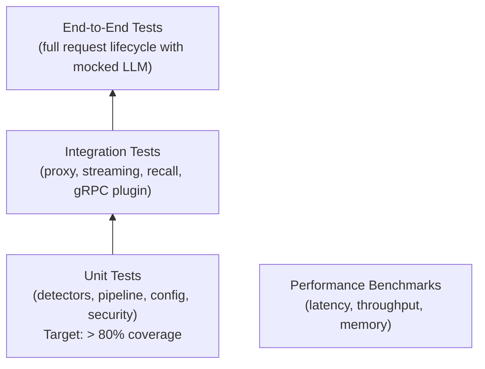

### 17.2 Unit Tests

| Component | Test Scope | Key Scenarios |
|-----------|-----------|---------------|
| Detectors | Each detector independently | `allow`, `flag`, `block`, `modify` actions; threshold boundaries; empty input; very long input; multilingual content |
| Pipeline engine | Parallel execution, short-circuit, aggregation | Block short-circuit cancels remaining; modify priority ordering; flag escalation; detector error handling (fail_open/fail_closed) |
| Content extractor | OpenAI request parsing | Multiple messages; multimodal content; system/user/assistant roles; empty messages; nested content parts |
| Config validation | Pydantic schema | Valid configs; invalid thresholds; missing files; unknown detectors; conflicting routing rules |
| Security | Auth, rate limiting, request_id | Valid/invalid API keys; rate limit exceeded; request_id generation and propagation |
| Circuit breaker | State transitions | Closed -> Open (threshold reached); Open -> Half-Open (timeout); Half-Open -> Closed/Open |

### 17.3 Integration Tests

| Test | Description | Mock Strategy |
|------|-------------|---------------|
| `test_proxy.py` | End-to-end request forwarding through gateway | Mock LLM provider with httpx mock |
| `test_streaming.py` | SSE streaming with sliding window detection | Mock streaming LLM provider |
| `test_recall.py` | Post-audit recall mechanism (SSE + webhook) | Mock LLM + webhook receiver |
| `test_grpc_plugin.py` | gRPC sidecar detector integration | In-process gRPC test server |

### 17.4 Detector Accuracy Tests

Each detector has a dedicated accuracy test suite with standardized datasets:

| Detector | Dataset | Metrics |
|----------|---------|---------|
| Prompt Injection | 500+ labeled prompts (injection + benign) | Precision, Recall, F1 |
| PII Redaction | 200+ samples with known PII entities | Precision, Recall, F1 per entity type |
| Toxicity | 1000+ labeled comments (toxic + non-toxic) | Precision, Recall, F1 |
| Sensitive Words | Curated word lists + edge cases | Match accuracy, false positive rate |
| Secret Leak | 100+ samples with known secrets | Detection rate per pattern type |

**Adversarial test cases**: Each detector includes evasion attempts:
- Obfuscated text (l33tsp34k, Unicode homoglyphs)
- Encoded content (base64, URL encoding)
- Context-dependent injection (indirect prompts)
- Mixed language evasion

### 17.5 Performance Tests

| Benchmark | Description |
|-----------|-------------|
| `bench_pipeline.py --suite latency` | Measure P50/P95/P99 detection latency |
| `bench_pipeline.py --suite throughput` | Measure requests/second under load |
| `bench_pipeline.py --suite streaming` | Measure streaming overhead per window |
| `bench_pipeline.py --suite memory` | Measure peak memory usage |

### 17.6 Test Data Management

| Data Type | Source | Storage |
|-----------|--------|---------|
| PII samples | Synthetic data generator (not real PII) | `tests/fixtures/pii_samples.json` |
| Toxic content | Curated public datasets + synthetic | `tests/fixtures/toxic_samples.json` |
| Injection prompts | Curated + adversarial generation | `tests/fixtures/injection_samples.json` |
| Secret patterns | Synthetic (generated API keys, tokens) | `tests/fixtures/secret_leak_samples.json` |
| Mock LLM responses | Pre-recorded fixtures | `tests/fixtures/mock_responses/` |

### 17.7 Mock LLM Provider

For integration and E2E tests, a mock LLM provider is used:

```python
# tests/conftest.py
@pytest.fixture
def mock_llm_provider():
    """Mock LLM provider that returns configurable responses."""
    provider = MockLLMProvider()
    provider.set_response("default", {"content": "This is a safe response."})
    provider.set_response("toxic", {"content": "This is a toxic response."})
    provider.set_streaming_response("stream_safe", ["This ", "is ", "safe."])
    return provider
```

---

### Versioning Policy (v0.1.0, 2026-08-15)

SemVer-aligned release strategy:

| Version | Meaning |
|---------|---------|
| v0.0.x | Internal development phases (not for public distribution) |
| v0.x.y | Public test releases — API may change between releases (current: v0.1.0) |
| v1.0.0 | General availability — stable public API, formal release |

The first public test release is v0.1.0 (previously labeled v1.0.0 internally).
When the project is confident the API is stable and validated, the version
moves to v1.0.0 (GA).

## 18. Development Roadmap

Estimated based on AI-assisted programming efficiency (using tools like Trae, Copilot, etc.):

### Phase 1: v0.0.1 - Framework Skeleton (2-3 days)

| Deliverable | Description |
|-------------|-------------|
| FastAPI server | Basic app with OpenAI-compatible endpoints (`/v1/chat/completions`) |
| Config system | YAML loading, Pydantic validation, env var override, validation rules |
| Provider proxy | Forward requests to OpenAI provider, return responses |
| Content extractor | Extract text from OpenAI messages array, modify writeback |
| Docker setup | Dockerfile + basic docker-compose.yml |
| Health endpoints | `/health`, `/ready`, `/metrics` |
| Request ID | Generation, propagation, response header |

### Phase 2: v0.0.2 - Pipeline & Detectors (3-4 days)

| Deliverable | Description |
|-------------|-------------|
| Pipeline engine | Parallel execution, short-circuit on block, result aggregation, priority ordering |
| DetectionResult model | Threshold-driven action, risk level, confidence |
| Detector base class | Abstract interface, DetectionContext, lifecycle (init/health/shutdown) |
| Detector registry | Built-in + entry point discovery |
| 5 MVP detectors | Prompt Injection, PII Redaction, Toxicity, Sensitive Words, Secret Leak |
| Detector config | Per-detector thresholds, on_error strategy, priority |
| ML model management | Download, cache, offline mode |
| Language detection | langdetect integration, context propagation |
| Circuit breaker | For external/LLM-as-Judge detectors |
| Block response format | OpenAI-compatible error + safety extension field |

### Phase 3: v0.0.3 - Streaming & Audit (3-4 days)

| Deliverable | Description |
|-------------|-------------|
| SSE streaming proxy | Transparent streaming passthrough |
| Sliding window detection | Character-based window, configurable size/overlap |
| Streaming memory management | Max response size, block/truncate policy |
| Post-audit | Full-response deep detection after stream completes |
| Recall mechanism | SSE event + optional webhook recall signal |
| Non-streaming output detection | Configurable sync/async mode |
| JSONL audit logger | Structured audit log with daily rotation |
| stdout structured output | JSON logging for external collectors |
| Log sanitization | Redact API keys, auth headers from logs |

### Phase 4: v0.0.4 - Security & Observability (2-3 days)

| Deliverable | Description |
|-------------|-------------|
| API Key authentication | Bearer token validation |
| Rate limiting | Token bucket per API Key / IP, 429 + Retry-After |
| Request size limit | Max body size enforcement |
| Timeout control | Upstream + detector timeouts |
| CORS support | Optional, configurable |
| TLS support | Native TLS termination option |
| Prometheus metrics | Gateway, detector, provider, recall metrics |
| OpenTelemetry tracing | Optional, configurable sampling |
| Graceful shutdown | SIGTERM handling, in-flight request completion |

### Phase 5: v0.0.5 - Plugin Ecosystem (3-4 days)

| Deliverable | Description |
|-------------|-------------|
| gRPC sidecar support | Protobuf contract, gRPC client, lifecycle management |
| Plugin loader | Entry points + gRPC discovery, health checking |
| Detector SDK | Separate package, base classes, testing utils, CLI scaffolding |
| Plugin CLI | List, info, test, check-connection commands |
| Example plugins | Python in-process, Python gRPC, Go gRPC |
| Plugin documentation | Detector development guide, gRPC guide, commercial guide |

### Phase 6: v0.1.0 - First Public Test Release (2-3 days)

| Deliverable | Description |
|-------------|-------------|
| Documentation | Getting started, configuration, API spec, detector dev, deployment guides |
| Test coverage | Unit tests > 80%, integration tests for critical paths, accuracy tests |
| Performance optimization | Benchmark validation against targets |
| Docker Compose production config | Multi-replica, resource limits, health checks, sidecar |
| GitHub repository setup | README, CONTRIBUTING, issue/PR templates, CI pipeline |

### Total Timeline

| Phase | Version | Duration |
|-------|---------|----------|
| Framework Skeleton | v0.0.1 | 2-3 days |
| Pipeline & Detectors | v0.0.2 | 3-4 days |
| Streaming & Audit | v0.0.3 | 3-4 days |
| Security & Observability | v0.0.4 | 2-3 days |
| Plugin Ecosystem | v0.0.5 | 3-4 days |
| First Public Test Release | v0.1.0 | 2-3 days |
| **Total** | **v0.1.0** | **15-21 days (~3 weeks)** |

### Post-v0.1.0 Roadmap (until v1.0.0 GA)

| Version | Focus |
|---------|-------|
| v0.2.0 | K8s Helm Chart, Redis rate limiting, provider failover, additional detectors (jailbreak, hallucination), mTLS |
| v0.3.0 | Anthropic/Gemini provider support, RBAC, multi-tenancy, embeddings detection |
| v0.4.0 | Agent execution rails, dashboard/observability UI, pluggable tokenizer, plugin marketplace |

---

## 19. Open Source Governance

### 19.1 License

**Apache License 2.0**

Rationale:
- Most widely used license in the LLM/AI open-source ecosystem (NeMo Guardrails, Guardrails AI, Llama Guard)
- Permits commercial use with patent grant
- Enterprise legal teams are familiar and comfortable with it
- Compatible with third-party commercial detectors (vendors can license their detectors separately)

### 19.2 Contribution Model

- Standard GitHub Fork + Pull Request workflow
- `CONTRIBUTING.md` documenting: development setup, code style, commit format, PR review process
- All contributors must sign the Apache 2.0 CLA (Contributor License Agreement)
- Third-party detector plugins are independent packages and do not require CLA (they use the SDK under Apache 2.0)

### 19.3 Version Management

- Semantic Versioning (SemVer): `MAJOR.MINOR.PATCH`
- Pre-v1.0: `v0.X.Y` for iterative development
- v1.0.0: First stable release
- Release notes in GitHub Releases for every version
- Detector SDK versioned independently from the gateway

### 19.4 CI/CD

GitHub Actions pipeline:
1. **On PR**: lint (ruff) + type check (mypy) + unit tests
2. **On merge to main**: build Docker image + push to registry + integration tests
3. **On tag**: publish Python package to PyPI + publish Docker image with version tag
4. **SDK package**: Separate CI pipeline, published to PyPI independently

### 19.5 Plugin Ecosystem Governance

| Aspect | Policy |
|--------|--------|
| Open-source plugins | Listed in documentation, linked from README |
| Commercial plugins | Listed in documentation with "Commercial" tag; gateway project does not endorse or warranty |
| Plugin compatibility | Each plugin declares compatible gateway version range |
| Security disclosure | Plugin security vulnerabilities are the plugin vendor's responsibility; gateway project discloses gateway-level vulnerabilities |
| Plugin review | Open-source plugins can request review (voluntary); commercial plugins are not reviewed by the gateway project |

---

## Appendix A: Decision Summary

All key design decisions:

| # | Decision | Choice |
|---|----------|--------|
| 1 | Deployment mode | Proxy gateway (no SDK) |
| 2 | Pipeline execution | Parallel + short-circuit on block, full risk profile if all pass |
| 3 | Streaming | Sliding window + post-audit, configurable; recall supported |
| 4 | API compatibility | OpenAI API compatible (primary target) |
| 5 | Detection result model | Threshold-driven actions + parallel aggregation; flag does not auto-escalate |
| 6 | Detector interface | Async `detect(content, context) -> DetectionResult`; entry points + gRPC plugin system |
| 7 | MVP detectors | Prompt Injection, PII Redaction, Toxicity, Sensitive Words, Secret Leak (5) |
| 8 | Configuration | YAML + env var override; no hot reload |
| 9 | Docker | Docker + Docker Compose; K8s in v0.2.0+ |
| 10 | Audit logs | JSONL file + stdout; no built-in cloud exporters (use external collectors) |
| 11 | Error handling | Fail-Open default, configurable Fail-Closed per detector |
| 12 | Performance targets | < 5ms P95 (rule-based only), < 100ms P95 (rule-based + ML), 1000 req/s, horizontal scaling |
| 13 | LLM providers | openai, azure_openai, openai_compatible (MVP) |
| 14 | Recall signal | SSE event (default) + webhook (optional) |
| 15 | Internationalization | English-first, Chinese adaptation; bilingual detector content |
| 16 | Package name | `z_llm_safety_gateway` |
| 17 | License | Apache 2.0 |
| 18 | Web framework | FastAPI + Pydantic v2 + httpx + structlog |
| 19 | PII detection | Microsoft Presidio |
| 20 | Recall behavior | No session blocking, no immediate alert; recorded as security finding |
| 21 | Block response format | Input: HTTP 400 (bad request); Output: HTTP 422 (unprocessable entity). Both use OpenAI-compatible error + custom `safety` extension field |
| 22 | Non-streaming output detection | Configurable: sync (default) or async |
| 23 | Content extraction | Check system + user messages; skip assistant/tool messages; text parts only (MVP) |
| 24 | Modify writeback | Replace specific message content; multimodal preserves image parts |
| 25 | Sliding window unit | Character-based (MVP); pluggable tokenizer (v0.2.0+) |
| 26 | Detector priority | Explicit `priority` field; default 100; YAML order as tiebreaker |
| 27 | Circuit breaker | Configurable per detector; for external/gRPC/LLM-as-Judge detectors |
| 28 | Third-party detector modes | In-process (Python entry points) + gRPC sidecar |
| 29 | Commercial detector support | Configuration passthrough only; no built-in licensing/metering |
| 30 | Detector SDK | Separate package (`z_llm_safety_gateway_sdk`); independent versioning |
| 31 | ML model distribution | HuggingFace Hub download on first use; cache directory; offline mode |
| 32 | Language detection | langdetect; per-message; stored in DetectionContext |
| 33 | Sensitive word matching | Aho-Corasick automaton for O(n) multi-pattern matching |
| 34 | Rate limiting | In-memory (MVP); Redis (v0.2.0+); 429 + Retry-After headers |
| 35 | Request ID | UUID v4 generated or client-propagated via X-Request-ID header |
| 36 | Observability | Prometheus metrics + OpenTelemetry tracing (optional) |
| 37 | Graceful shutdown | SIGTERM; stop_timeout 30s; flush logs; close detector resources |
| 38 | Streaming memory | Max response size (1MB default); block or truncate policy |
| 39 | Provider failover | Not in MVP; planned for v0.2.0 |
| 40 | Log sanitization | Redact auth headers, API keys from all logs (default: on) |
| 41 | Output modification writeback | Non-streaming sync mode only; writes to `choices[0].message.content`; async/streaming: not applied |
| 42 | Streaming modify behavior | Downgraded to `flag` (tokens already sent); recorded in audit with `applied: false` |
| 43 | Buffer mode + post-audit | Post-audit auto-skipped in buffer mode (full detection already runs pre-send) |
| 44 | Webhook recall retry | 3 retries, exponential backoff (1s/2s/4s), 5s timeout; no persistent queue in MVP |
| 45 | Flag escalation rule | Simple DSL (not Python eval); supports count, max_risk_level, categories; parsed at config load |
| 46 | Parallel modify limitation | All modifications computed on original content; sequential chaining is a v0.2.0+ feature |
| 47 | Provider error handling | No retry in MVP; all provider errors wrapped as HTTP 502 `provider_error`; failover in v0.2.0+ |
| 48 | `/v1/models` passthrough | Forwards to first configured provider; no aggregation in MVP |
| 49 | Audit log granularity | One entry per direction (input + output are separate entries, linked by request_id) |
| 50 | DetectionResult source | Defined in SDK; gateway re-exports; `pipeline/result.py` contains aggregation logic only |
| 51 | Output language detection | Non-streaming: detected on full response; streaming: reuses input language for all windows |
| 52 | Async audit logging | Dual entries: initial (pending) + completion (with full results); linked by request_id |
| 53 | gRPC details type | `google.protobuf.Struct` (arbitrary JSON), aligned with in-process `dict` |
| 54 | Output block status code | HTTP 422 Unprocessable Entity (request valid, response content unacceptable); input block remains HTTP 400 |
| 55 | Modification type | Defined in SDK (`z_llm_safety_gateway_sdk.modification`); constructed by pipeline engine from `DetectionResult` + `DetectionContext` + detector config `priority`; not created by detectors |
| 56 | gRPC DetectRequest parity | Includes `message_index` field (int32, -1 for output) to match in-process `DetectionContext`; gRPC and in-process detectors receive identical context |
| 57 | Buffer mode SSE delivery | Gateway replays original SSE chunks to client after buffer detection passes; preserves SSE protocol contract; increases time-to-first-token |
| 58 | `safety_flag` event granularity | One aggregated event per sliding window (not per detector); includes highest `risk_level` and comma-separated `flagged_by` list |
| 59 | Async `X-Safety-Action` header | Reflects only input detection result at response time; output detection outcome delivered via webhook |
| 60 | `model_version` config | Maps to HuggingFace Hub `revision` parameter (branch/tag/commit); optional, defaults to latest |
| 61 | Detector availability policy | `required` controls startup admission; optional `fail_closed` blocks readiness and requests; optional `fail_open` is explicitly degraded; all signals share an app-scoped lifecycle registry |

---

## Appendix B: Open Questions & Future Decisions

The following items are identified but not yet decided. They are deferred to future versions and will be revisited.

| # | Topic | Question | Target Version |
|---|-------|----------|----------------|
| 1 | Plugin marketplace | Should the gateway host a plugin registry/catalog for discovery, installation, and rating of detectors? (Like VS Code marketplace) | v0.4.0+ |
| 2 | Multi-tenancy config isolation | How should different tenants have different detector configurations, thresholds, and word lists? Current API Key model has no tenant concept. | v0.3.0 |
| 3 | Agent execution rails | How should the gateway handle agent/tool-use workflows where the LLM makes multiple tool calls? Detect each tool call? Detect the full agent trajectory? | v0.4.0 |
| 4 | Multimodal content detection | How to detect unsafe content in image inputs (GPT-4V) and image outputs (DALL-E)? | v0.3.0+ |
| 5 | Embedding endpoint detection | Should `/v1/embeddings` requests be checked? What would input detection look like for embeddings (no generation, but could leak PII)? | v0.2.0+ |
| 6 | Pluggable tokenizer | Which tokenizers to support for sliding window? tiktoken (OpenAI), SentencePiece (Gemini), or a generic fallback? | v1.1+ |
| 7 | Hot reload | Should configuration hot reload be supported? What about reloading detectors without dropping connections? | v1.1+ (if requested) |
| 8 | Distributed rate limiting | Redis backend for multi-instance rate limiting. How to handle Redis unavailability (fail-open vs fail-closed)? | v1.1 |
| 9 | Content storage encryption | If `store_content: true`, should stored content be encrypted at rest? | v1.1+ (if requested) |
| 10 | Detector model update notifications | How to notify users when a new version of an ML model is available? Auto-update vs manual? | v1.2+ |
| 11 | Sequential execution mode | Should `execution_mode: sequential` be supported? Use cases: detector dependencies (detector B needs detector A's output), cost optimization (stop after first block in priority order). How to express dependencies? | v1.1+ |
| 12 | Model sharing for dual-direction detectors | Should the toxicity detector (configured for both input and output) share a single loaded model instance to reduce memory (~50% savings)? Requires a model registry. | v1.1+ |
| 13 | Persistent recall queue | Webhook recalls are not persisted. Should a persistent queue (e.g., Redis) be used to survive gateway restarts? What delivery guarantees are needed? | v1.1+ |
| 14 | `/v1/models` aggregation | Should the gateway aggregate model lists from all configured providers and filter by routing rules? Currently only the first provider's list is returned. | v1.1+ |
